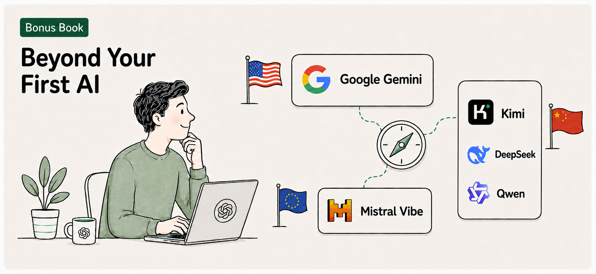
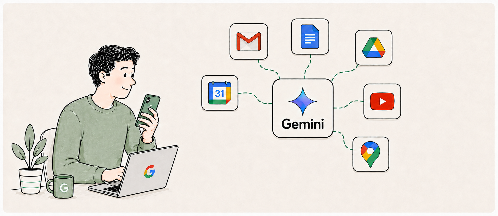
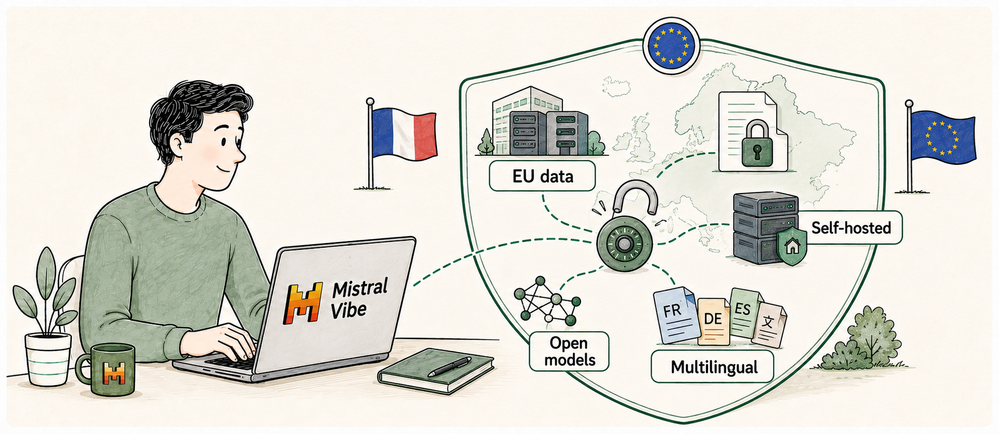
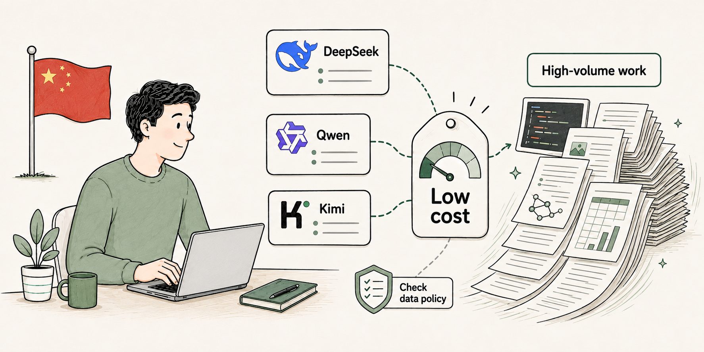

> **A free bonus online-only guide for *Claude Visual Bible* — not included in the print edition**



- [Introduction](#introduction)
- [Chapter 1: Comparing Claude to ChatGPT](#chapter-1-comparing-claude-to-chatgpt)
  - [What makes each one distinct](#what-makes-each-one-distinct)
  - [Same idea, different name](#same-idea-different-name)
  - [Cost and plans](#cost-and-plans)
  - [Who is actually using which one](#who-is-actually-using-which-one)
  - [Try it now](#try-it-now)
    - [Check the result](#check-the-result)
- [Chapter 2: Google Gemini as a backup AI](#chapter-2-google-gemini-as-a-backup-ai)
  - [What makes it distinct](#what-makes-it-distinct)
  - [Weighing it against ChatGPT and Claude](#weighing-it-against-chatgpt-and-claude)
  - [Cost and how to sign up](#cost-and-how-to-sign-up)
  - [Try it now](#try-it-now-1)
    - [Check the result](#check-the-result-1)
- [Chapter 3: Mistral Vibe as an EU-compliant AI](#chapter-3-mistral-vibe-as-an-eu-compliant-ai)
  - [What makes it distinct](#what-makes-it-distinct-1)
  - [Weighing it against ChatGPT and Claude](#weighing-it-against-chatgpt-and-claude-1)
  - [Cost and how to sign up](#cost-and-how-to-sign-up-1)
  - [Try it now](#try-it-now-2)
    - [Check the result](#check-the-result-2)
- [Chapter 4: DeepSeek, Qwen, and Kimi as low-cost AIs](#chapter-4-deepseek-qwen-and-kimi-as-low-cost-ais)
  - [What makes them distinct](#what-makes-them-distinct)
  - [Weighing them against ChatGPT and Claude](#weighing-them-against-chatgpt-and-claude)
  - [Cost and how to sign up](#cost-and-how-to-sign-up-2)
  - [Try it now](#try-it-now-3)
    - [Check the result](#check-the-result-3)
- [Chapter 5: Choosing the right AI for the job](#chapter-5-choosing-the-right-ai-for-the-job)
  - [Five-way comparison of popularity of AI services](#five-way-comparison-of-popularity-of-ai-services)
  - [Try it now](#try-it-now-4)

# Introduction

In *Claude Visual Bible*, *Book 1* to *Book 4* taught you to work with Claude: how to ask it good questions, build real results, automate your own workflows, and use it to advance your career. Claude still belongs at the center of that work. This bonus book adds one more skill: knowing when a different AI is the better tool for a specific job, or a backup when your primary AI is unavailable.

You will meet four alternatives: 
1. **OpenAI ChatGPT** is sometimes the stronger choice for a broader ecosystem.
2. **Google Gemini** integrates into Google's other products and can hold very large amounts of text, images, and video at once.
3. **Mistral Vibe**, from the French company Mistral AI, matters if you work under European data rules.
4. **DeepSeek**, **Qwen**, and **Kimi** trade a smaller support ecosystem for a lower price, with a privacy trade-off worth understanding first.

This guide is not a recommendation to leave Claude. It is also not a full buyer's guide to every AI assistant on the market. Treat it as a short field guide: enough to recognize each tool by name, know its one or two strongest uses, and decide for yourself when it earns a place next to Claude on your desktop.

# Chapter 1: Comparing Claude to ChatGPT

ChatGPT is the AI assistant you are most likely to hear mentioned alongside Claude. Both are general-purpose assistants built by AI research companies, and both can write, summarize, analyze, and answer questions in plain language. The differences show up in where each one is strongest.

## What makes each one distinct

Anthropic built Claude with a focus on writing quality and careful, step-by-step reasoning. Anthropic markets Claude heavily toward professional and enterprise use, and its writing and reasoning quality reflect that focus. In the past year, Anthropic overtook OpenAI in market valuation due to its success in selling to the corporate market, led by Claude Code for software developers. OpenAI has spent the past six months racing to catch up, matching Claude feature-for-feature and trying to undercut them on cost.

OpenAI built ChatGPT for the broadest possible audience. It reaches more consumers than any other AI assistant (OpenAI recently claimed over 1 billion weekly active users), supports the widest range of input and output types in one place (text, images, voice, and more), and sits inside the largest outside ecosystem of any assistant. It has abandoned distracting products like Sora (AI-generated video) to refocus on enterprise markets like Anthropic does. If you want an AI assistant with the most built-in features and the most existing tools built around it, ChatGPT remains a safe default.

## Same idea, different name

Claude and ChatGPT often solve the same problem with a feature that carries a different name. The table below maps the closest matches.

| What you want to do | ChatGPT calls it | Claude calls it |
| --- | --- | --- |
| Work in a "super app" | ChatGPT app | Claude app |
| Ask and research | Chat | Chat |
| Create documents | Work | Cowork |
| Software development | Codex | Code |
| Build or edit a document beside the conversation | Writing block | Artifacts |
| Keep files and instructions together for one ongoing job | Projects | Projects |
| Build a reusable, task-specific assistant | Skills | Skills |
| Build a reusable, sharable specialized AI | Custom GPTs | - |
| Install an extension | Plugins | Plugins |
| Connect to external systems | Apps, MCP | Connectors, MCP |
| Control the local computer | Computer Use | Computer Use |

## Cost and plans

Both companies offer a free tier with usage limits, individual paid plans for regular use, and separate plans for teams and businesses with enterprise features like organizational controls. 

Here's the official pricing/plans page for each:

- **ChatGPT**: [openai.com/chatgpt/pricing](https://openai.com/chatgpt/pricing) — covers Free, Go, Plus, and Pro; a separate [Business pricing page](https://openai.com/business/chatgpt-pricing/) covers Business and Enterprise.
- **Claude**: [claude.com/pricing](https://claude.com/pricing) — covers Free, Pro, Max, Team, and Enterprise.
- **Google Gemini**: [one.google.com/about/google-ai-plans](https://one.google.com/intl/en_us/about/google-ai-plans/) — covers Free, AI Plus, AI Pro, and the two AI Ultra tiers.
- **Mistral Vibe**: [mistral.ai/pricing](https://mistral.ai/pricing) — covers Free, Pro, Team, and Enterprise for the renamed Le Chat/Vibe app.

## Who is actually using which one

Popularity figures for AI assistants shift from month to month, so treat any specific number as a snapshot rather than a permanent ranking.

Anthropic's share of enterprise spending on large-language-model access grew from 24% in 2024 to 40% in 2025, overtaking OpenAI's 27% share, according to Menlo Ventures' *2025 State of Generative AI in the Enterprise* report. Among individual developers, OpenAI's models remained the most widely used overall, but Claude's Sonnet models were used by 45% of professional developers, compared with 30% of those still learning to code, according to Stack Overflow's 2025 Developer Survey, published in December 2025.

To summarize, ChatGPT has the widest reach across casual and consumer use. Claude has grown fastest among people who write, reason, and code for a living aka professionals.

Metric|OpenAI ChatGPT|Anthropic Claude
---|---|---
Total users (all tiers)|900 million weekly active users|Not officially disclosed. Third-party estimates for monthly active users start at 12 million and go up from there
$20/month tier (Plus / Pro)|An unofficial figure from a mid-2025 court filing put Plus at roughly 12 to 15.5 million subscribers|Anthropic confirmed to reporters that combined Pro + Max paid subscriptions "more than doubled" since the start of 2026, without giving an absolute count
$100–$200/month tier (Pro / Max)|Third-party analysis puts ChatGPT Pro ($200) at roughly 500,000+ subscribers|Not disclosed as a standalone number
Business / Team / Enterprise accounts|More than 9 million paying business users|More than 300,000 business customers; more than 1,000 of those customers each spend over $1 million a year
Total paid subscribers, all consumer tiers combined|More than 50 million|Not officially disclosed


## Try it now

Send the same request to ChatGPT and Claude:
```
Draft a two-paragraph message to a client explaining a two-week delay to a project, in a tone that is apologetic but confident.
```
Read both replies side by side before you decide which one you would send.

### Check the result
- [ ] Did each assistant produce a complete, ready-to-edit draft?
- [ ] Did one draft sound closer to how you actually write?
- [ ] Would you feel comfortable sending either draft with only light editing?

Now let's look at using Google Gemini as a third AI choice.

# Chapter 2: Google Gemini as a backup AI

Google Gemini is worth a second look once you outgrow occasional use of ChatGPT, especially if you already use Google's products. Think of Gemini as a second opinion you keep on hand, not a replacement for the assistant you already trust.

## What makes it distinct

Gemini connects directly to Gmail, Google Docs, Sheets, and Drive, so it can read and act on files you already store there without an upload step. Google's larger Gemini models can hold well over a million tokens of text, images, audio, and video in a single conversation, among the largest context windows of any mainstream assistant, which makes Gemini a strong choice for questions about a long video, a lengthy recording, or a large batch of documents at once. Gemini also connects tightly to Google Search, so its answers to current-events questions often come with clearer, more immediate web grounding than assistants that search less consistently.



## Weighing it against ChatGPT and Claude

Choosing between ChatGPT, Claude, and Gemini can feel a little like choosing between familiar soft drinks: all three do the core job well, and the right pick often comes down to which ecosystem you are already standing in. If your work already runs through Gmail and Google Docs, that alone can tip the balance toward Gemini.

## Cost and how to sign up

Gemini offers a free tier alongside paid individual and business plans, similar in structure to ChatGPT and Claude. Because most readers already have a Google account, signing up for Gemini's free tier takes only a few seconds: no new account, password, or payment method required to get started. Check this page for current plan names and prices: [one.google.com/about/google-ai-plans](https://one.google.com/intl/en_us/about/google-ai-plans/)

> **Good practice:** Reach for Gemini specifically when your question depends on a Google Doc, Sheet, or Gmail thread, or when you need to work through something unusually long, such as a full recorded meeting or a lengthy report.

> **Watch out:** Gemini's default privacy and data-handling settings differ from ChatGPT's, particularly around what Google may use to improve its models and how that connects to your existing Google account activity. Review Gemini's current privacy settings before you send anything sensitive, the same habit Book 1 recommended for ChatGPT.

## Try it now

Open a long document or recording you already have in Google Drive. Ask Gemini to summarize it in five bullet points and flag anything that looks incomplete or contradictory. Compare that summary with what ChatGPT produces from the same file after you upload it.

### Check the result
- [ ] Did Gemini read the file directly from Drive without an upload step?
- [ ] Did the summary capture the points you consider most important?
- [ ] Did Gemini flag anything you had not already noticed yourself?

Now let's look at an EU-based option.

# Chapter 3: Mistral Vibe as an EU-compliant AI

If you work with clients or colleagues in Europe, you will eventually hear the name Mistral. Mistral AI is a French company, and its consumer assistant, recently renamed **Mistral Vibe** (formerly Le Chat), is built and hosted with European data rules in mind from the start.

## What makes it distinct

Mistral is headquartered in Paris, and Mistral Vibe processes and stores data on servers inside the European Union by default. That matters for any organization bound by the General Data Protection Regulation (GDPR), Europe's law governing how personal data is collected, stored, and used. Mistral also releases several of its models as open weights, meaning any organization with the right technical skill can download and run them on its own hardware instead of sending data to Mistral's servers at all. Mistral Vibe also performs strongly across European languages beyond English, including French, German, and Spanish.



## Weighing it against ChatGPT and Claude

Mistral Vibe's third-party app ecosystem and consumer feature set are smaller than ChatGPT's or Claude's. What it offers instead is a genuine compliance advantage: an EU-based company, EU data residency, and formal alignment with GDPR, which matters far more to a regulated European organization than an extra built-in feature does.

## Cost and how to sign up

Mistral Vibe offers free and paid tiers for everyday use, similar in structure to the other assistants in this guide. If you or your organization also builds software on top of Mistral's models directly, that use is billed separately as API access, distinct from a personal Mistral Vibe subscription. Check this page for current plan names and prices: [mistral.ai/pricing](https://mistral.ai/pricing)

This compliance angle returns in *Chapter 4*, when we look at the opposite end of the spectrum: assistants with little to no EU compliance story at all.

> **Good practice:** If your organization operates in the EU or handles the personal data of EU residents, ask your compliance or legal team whether Mistral Vibe's EU data residency changes what you are allowed to do with an AI assistant that ChatGPT or Claude cannot.

> **Learn more online:** New EU AI Act transparency rules took effect on August 2, 2026, requiring AI-generated content to be marked as artificial in most cases. See the European Commission's AI Act policy page at digital-strategy.ec.europa.eu for the current requirements and how they apply to general-purpose AI systems.

## Try it now

Ask Mistral Vibe and Claude the same question in a European language other than English, such as French or German. Compare the accuracy and natural phrasing of each response with a native or fluent speaker if you have one available.

### Check the result
- [ ] Did both assistants answer in the requested language without switching back to English?
- [ ] Did one response read more naturally than the other to a fluent speaker?
- [ ] Did you confirm where each assistant said your data would be processed?

Now let's review Chinese AI providers.

# Chapter 4: DeepSeek, Qwen, and Kimi as low-cost AIs

DeepSeek, Qwen, and Kimi are the names you are most likely to encounter when someone mentions a cheap, surprisingly capable alternative to the assistants covered so far. All three come from Chinese technology companies, and all three are worth understanding, including the trade-off that comes with their low price.

## What makes them distinct

DeepSeek, Qwen (from Alibaba), and Kimi (from Moonshot AI) compete aggressively on price, often charging a fraction of what ChatGPT, Claude, or Gemini charge for comparable use through their apps and developer access. Each also releases open-weight versions of its models, meaning any organization can download and run them independently. All three release new versions frequently, and independent benchmarks have repeatedly shown strong results relative to their cost.



## Weighing them against ChatGPT and Claude

The appeal is real: low cost, openness, and rapid improvement. The trade-offs are real too. Their surrounding support ecosystems are smaller than ChatGPT's or Claude's, and the more serious concern is where your data goes. When you use DeepSeek, Qwen, or Kimi through their hosted web chat or app, your prompts are processed on servers in China and fall under Chinese data law, including requirements that companies cooperate with government security requests. Several governments, including US federal agencies, have restricted the DeepSeek app on official devices for exactly this reason.

## Cost and how to sign up

All three offer free access through their web chat apps with no payment required to start. Organizations with the technical resources to self-host an open-weight model on their own hardware or a Western cloud provider can avoid sending any data to Chinese servers at all, though that setup is outside the scope of this guide.

> **Watch out:** Do not send confidential client information, health records, financial details, or any other regulated data through the hosted DeepSeek, Qwen, or Kimi apps or APIs. Once that data reaches a server in China, it falls under Chinese law rather than the privacy rules you may already follow for other tools. This same caution applies to any hosted AI service outside your own country whose data-handling rules you have not checked.

DeepSeek, Qwen, and Kimi each publish their pricing primarily on a developer platform page (API docs, token rates, and rate limits) rather than on a consumer plans page. That reflects how these companies expect to be used: as a model you connect to your own application, coding tool, or agent harness through an API key, priced by the token, rather than as a subscription a knowledge worker signs up for directly. Qwen and Kimi in particular are positioned almost entirely this way. Their public-facing chat apps exist, but the companies' own marketing and documentation point developers toward Alibaba Cloud Model Studio and the Kimi developer platform, not toward a branded consumer app with tiered plans. DeepSeek is the exception worth calling out separately below.

- **DeepSeek**: [api-docs.deepseek.com/quick_start/pricing](https://api-docs.deepseek.com/quick_start/pricing/) — DeepSeek's chat app itself is free with no consumer subscription tiers, so this API token-pricing page is the closest official equivalent to a "plans" page.
- **Qwen**: [alibabacloud.com/help/en/model-studio/model-pricing](https://www.alibabacloud.com/help/en/model-studio/model-pricing) — official pricing for Qwen models served through Alibaba Cloud Model Studio (formerly DashScope/Bailian).
- **Kimi**: [platform.kimi.ai/docs/pricing](https://platform.kimi.ai/docs/pricing/chat-v1) — Moonshot AI's official developer platform pricing docs for the Kimi models.

For a knowledge-worker experience close to what *Book 1* describes for the Claude desktop app, the best link is DeepSeek's own chat app at [chat.deepseek.com](https://chat.deepseek.com/). It's free for personal use, available on web, iOS, and Android, and includes a long context window and a visible reasoning mode comparable in spirit to Claude's features. But unlike ChatGPT and Claude, DeepSeek does not ship an official native desktop application for Windows or Mac. What circulates as "DeepSeek Desktop" is an unofficial, community-built wrapper around the same web app, not something DeepSeek maintains itself, so be careful if you choose to install that.

## Try it now

Give DeepSeek, Qwen, or Kimi a low-stakes, non-confidential writing or coding task you would normally give Claude, such as drafting a short blog outline. Compare the quality of the result against what Claude produces for the identical prompt.

### Check the result
- [ ] Did the free assistant complete the task without an account or payment?
- [ ] Was the quality close enough to Claude's to justify the cost difference for this kind of task?
- [ ] Did you confirm the task involved no confidential or regulated information?

Finally, let's compare all the AI options we've introduced and choose the ones best for your work.

# Chapter 5: Choosing the right AI for the job

Claude should remain your default assistant. Everything in this guide is about recognizing the handful of situations where a different tool serves you better, then returning to Claude for everything else. Use the matrix below as a quick reference the next time you are unsure which assistant to open.

| If you need | Consider first | Why |
| --- | --- | --- |
| Stronger writing quality or careful, multi-step reasoning | Claude | Built and marketed around writing and reasoning depth |
| An assistant with the broadest features and outside app support | ChatGPT | Widest consumer reach and third-party ecosystem |
| Deep access to Gmail, Docs, Sheets, or a very long document or video | Gemini | Native Google Workspace integration and a very large context window |
| EU data residency or GDPR alignment | Mistral Vibe | EU-based company with EU data processing by default |
| The lowest possible cost, or an open-weight model to self-host | DeepSeek, Qwen, or Kimi | Aggressive pricing and open-weight availability |
| To handle confidential, client, or regulated data | ChatGPT, Claude, Gemini, or Mistral Vibe, under a paid or enterprise plan | Avoid hosted apps whose data-handling rules you have not confirmed |

## Five-way comparison of popularity of AI services

Product|Total users (official)|Paid individual subscribers (official)|Business/enterprise customers (official)
---|---|---|---
Claude (Anthropic)|Not officially disclosed|Not officially disclosed (paid subscriptions "more than doubled" since start of 2026)|300,000+ business customers; 1,000+ spending $1M+/year
ChatGPT (OpenAI)|900 million weekly active users|50 million+, all tiers combined|9 million+ paying business users
Gemini (Google)|950 million+ monthly active users|Not officially disclosed|Not officially disclosed
Mistral Vibe (Mistral AI)|Not officially disclosed. Predecessor Le Chat reported 1 million downloads in its first 14 days|Not officially disclosed|Not officially disclosed
Microsoft Copilot|Not officially disclosed as a single figure (third-party estimates put combined Windows/web/mobile users around 218 million, unconfirmed by Microsoft)|Microsoft 365 Copilot: 30 million+ paid seats. GitHub Copilot: 4.7 million paid subscribers|Included in the M365 Copilot seat figure, which is sold mainly as business/enterprise seats

Neither Google nor Mistral publicly breaks out paid-tier subscriber counts the way OpenAI does, and Anthropic discloses business-customer counts and spending cohorts but not consumer tier splits.

This is a sensitive-adjacent business topic (competitive/financial claims), so treat any single figure here as a snapshot: these companies update these numbers every few months, and definitions (weekly vs. monthly active, "business user" vs. "seat") aren't standardized across companies.

## Try it now

Pick one real task from your week ahead. Run it through the first matrix in this chapter, choose an assistant based on the result, and complete the task there instead of defaulting to whichever assistant you happen to have open.
