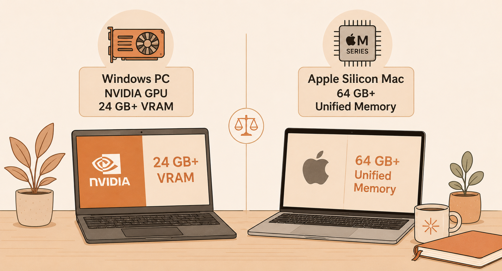
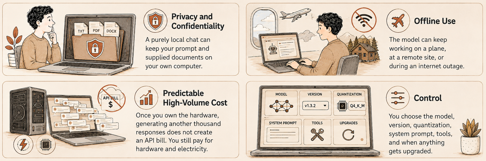
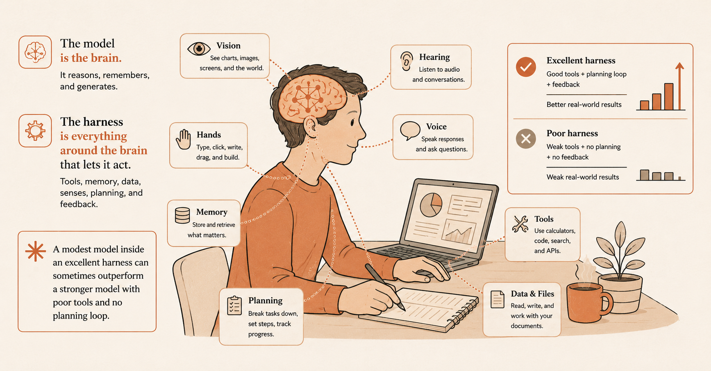
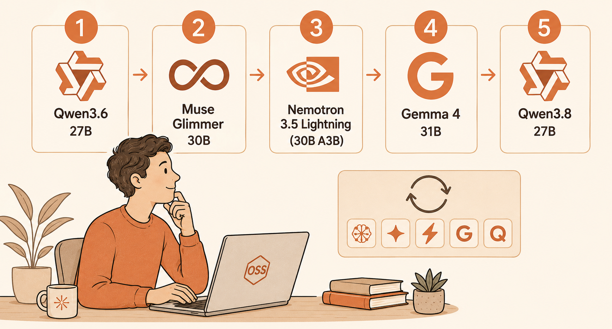
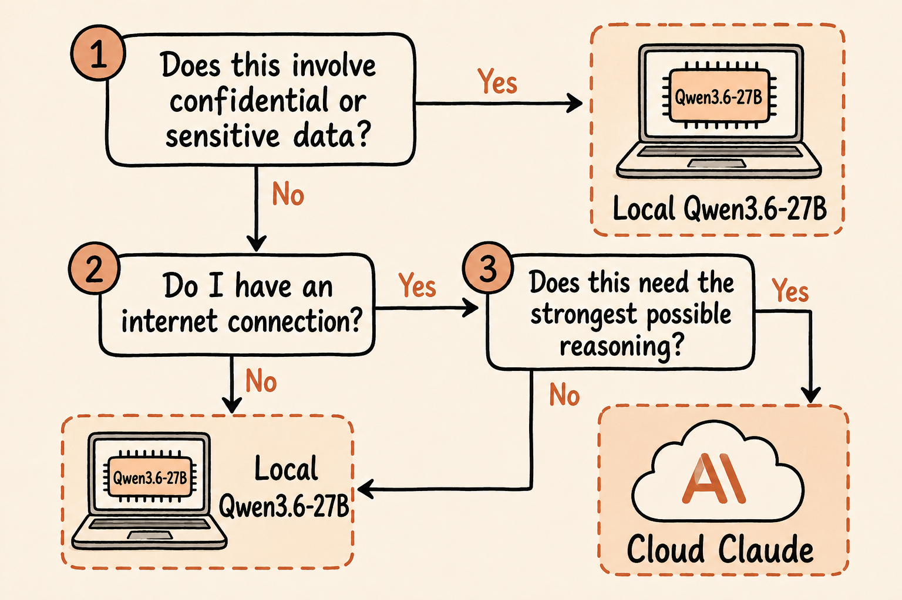

> **A free bonus online-only guide to the *Claude Visual Bible*, not included in the print edition**

# Bonus Book: Local AI Models


---
*Technical details in this guide were last verified against primary sources in August 2026. Local AI models and tools change quickly. Confirm current requirements before relying on them.*

- [Bonus Book: Local AI Models](#bonus-book-local-ai-models)
  - [](#)
- [Introduction](#introduction)
  - [](#-1)
- [Chapter 1: Why run an AI model on your own hardware](#chapter-1-why-run-an-ai-model-on-your-own-hardware)
  - [What local AI actually means](#what-local-ai-actually-means)
  - [](#-2)
  - [The trade-off: privacy and control versus frontier capability](#the-trade-off-privacy-and-control-versus-frontier-capability)
  - [](#-3)
  - [Removing the safety behavior](#removing-the-safety-behavior)
    - [What uncensored and abliterated mean](#what-uncensored-and-abliterated-mean)
    - [Genuine reasons people want one](#genuine-reasons-people-want-one)
    - [How to find a suitable model](#how-to-find-a-suitable-model)
  - [Try it now](#try-it-now)
    - [Check the result](#check-the-result)
- [Chapter 2: Meet four strong local models](#chapter-2-meet-four-strong-local-models)
  - [Google Gemma 4 31B](#google-gemma-4-31b)
  - [Alibaba Qwen3.6-27B](#alibaba-qwen36-27b)
  - [Meta Muse Glimmer 30B](#meta-muse-glimmer-30b)
  - [NVIDIA Nemotron 3.5 Lightning 30B A3B](#nvidia-nemotron-35-lightning-30b-a3b)
  - [Which should you try first?](#which-should-you-try-first)
  - [](#-4)
- [Chapter 3: The hardware these models need](#chapter-3-the-hardware-these-models-need)
  - [Why model size is not the whole story](#why-model-size-is-not-the-whole-story)
  - [The 24 GB VRAM Windows PC with 32 GB RAM](#the-24-gb-vram-windows-pc-with-32-gb-ram)
  - [The 64 GB unified memory Apple Silicon Mac](#the-64-gb-unified-memory-apple-silicon-mac)
  - [Why quantization matters](#why-quantization-matters)
  - [Try it now](#try-it-now-1)
    - [Check the result](#check-the-result-1)
- [Chapter 4: Getting started with LM Studio](#chapter-4-getting-started-with-lm-studio)
  - [Install LM Studio](#install-lm-studio)
  - [Download a model](#download-a-model)
  - [Choose a quantization](#choose-a-quantization)
  - [Test several models with the same prompts](#test-several-models-with-the-same-prompts)
    - [Test 1: careful reading](#test-1-careful-reading)
    - [Test 2: factual uncertainty](#test-2-factual-uncertainty)
    - [Test 3: strict instructions](#test-3-strict-instructions)
    - [Test 4: creative voice](#test-4-creative-voice)
    - [Test 5: tool readiness](#test-5-tool-readiness)
  - [Try it now](#try-it-now-2)
    - [Check the result](#check-the-result-2)
- [Chapter 5: Give a local model web search with Tavily](#chapter-5-give-a-local-model-web-search-with-tavily)
  - [Why local models cannot normally search the web](#why-local-models-cannot-normally-search-the-web)
  - [What MCP adds](#what-mcp-adds)
  - [Install Node.js and check npx](#install-nodejs-and-check-npx)
  - [Create a Tavily account](#create-a-tavily-account)
  - [Connect Tavily to LM Studio](#connect-tavily-to-lm-studio)
  - [Test web search](#test-web-search)
  - [Privacy changes when you enable web search](#privacy-changes-when-you-enable-web-search)
  - [Try it now](#try-it-now-3)
    - [Check the result](#check-the-result-3)
- [Chapter 6: The curious case of Qwen's insecurity](#chapter-6-the-curious-case-of-qwens-insecurity)
  - [The Reddit observation](#the-reddit-observation)
  - [Why second-guessing can help](#why-second-guessing-can-help)
  - [Longer thinking is not automatically better thinking](#longer-thinking-is-not-automatically-better-thinking)
  - [What this teaches you about local models](#what-this-teaches-you-about-local-models)
  - [Try it now](#try-it-now-4)
    - [Check the result](#check-the-result-4)
- [Chapter 7: Choose between local and cloud AI](#chapter-7-choose-between-local-and-cloud-ai)
  - [Strong local use cases](#strong-local-use-cases)
  - [Where cloud AI still wins](#where-cloud-ai-still-wins)
  - [Patterns worth adopting](#patterns-worth-adopting)
  - [Try it now](#try-it-now-5)
    - [Check the result](#check-the-result-5)
- [Further reading](#further-reading)

# Introduction

The earlier books in this series taught you to use powerful AI assistants running in the cloud. You type a request, it travels across the internet to computers operated by the AI provider, and the answer comes back to you.

This guide covers the other path: **running the AI model on your own computer**.

That no longer means choosing one frontier model from one AI company. By 2026, NVIDIA, Meta, Alibaba, Google, and other developers are releasing surprisingly capable open-weight models that can run on high-end consumer PCs and Macs.

Four models are used as examples in this guide:

- **Google Gemma 4 31B**, Google's largest dense Gemma 4 model and a useful general-purpose local model.
- **Alibaba Qwen3.6-27B**, a compact dense model with strong general, coding, vision, and reasoning capabilities.
- **Meta Muse Glimmer 30B**, an open-weight model designed specifically for local agent workflows and consumer hardware.
- **NVIDIA Nemotron 3.5 Lightning 30B A3B**, an efficient mixture-of-experts model designed for tool use and long-running agents.

A fifth model deserves attention too. **Qwen3.8-27B** arrived in August 2026 as the newer successor to Qwen3.6-27B. It is new enough that its real-world strengths and weaknesses are still being discovered, so this guide uses the better-established Qwen3.6-27B as a main worked example while also examining Qwen3.8-27B in *Chapter 6*.

Two machines are used as practical reference points:

- A Windows laptop or desktop with an **NVIDIA GPU containing 24 GB or more of VRAM and 32 GB or more of RAM**.
- An Apple Silicon Mac with **64 GB or more of unified memory**.

---

---

Those are not minimum requirements. They are useful reference machines because models around 27B to 31B parameters are currently an interesting local-AI sweet spot: large enough to be genuinely useful, yet small enough to fit on powerful consumer hardware after quantization.

Do not expect a local model to turn your computer into a complete replacement for Claude, ChatGPT, Gemini, or another frontier cloud assistant. The raw model is only part of what makes a cloud AI product useful. Cloud assistants also have search, tools, connectors, code execution, file handling, memory, safety systems, orchestration, and enormous server hardware behind them.

Local AI is interesting because you can build some of that stack yourself.

# Chapter 1: Why run an AI model on your own hardware

## What local AI actually means

A cloud AI model runs on computers owned or rented by its provider. A local AI model runs on your own processor, GPU, and memory.

Once you have downloaded the model, the model itself can generate answers without an internet connection.

This gives you four major benefits:

1. **Privacy and confidentiality.** A purely local chat can keep your prompt and supplied documents on your own computer.
2. **Offline use.** The model can keep working on a plane, at a remote site, or during an internet outage.
3. **Predictable high-volume cost.** Once you own the hardware, generating another thousand responses does not create an API bill. You still pay for hardware and electricity.
4. **Control.** You choose the model, version, quantization, system prompt, tools, and when anything gets upgraded.

---

---

The word **local** needs one important qualification. The model may be local while one of its tools is not. If you connect your local model to Tavily for web search, for example, search queries and retrieved web information must travel across the internet. Local inference and completely offline operation are therefore not the same thing once tools are enabled.

## The trade-off: privacy and control versus frontier capability

It is easy to become overexcited about local AI. A 27B or 30B model running on your own computer can feel remarkable, especially when it writes useful prose, solves a programming problem, analyzes an image, or calls a tool.

But it is still not the same product as a frontier cloud assistant.

Cloud services can use models far larger than a laptop can hold. They can also surround the model with a sophisticated **harness**: the software that decides when to search, when to call tools, how to recover from errors, how to manage long tasks, and how to assemble the final answer.

This distinction matters throughout this guide:

> **The model is the brain. The harness is everything around the brain that lets it act.**

A modest model inside an excellent harness can sometimes outperform a stronger model with poor tools and no planning loop.

---

---

## Removing the safety behavior

Hosted AI services apply safety rules and moderation policies. With local open-weight models, users have much more control over the model they run, including the option to use community versions with fewer refusals.

### What uncensored and abliterated mean

An **uncensored model** is a loose community term for a model that has been trained or fine-tuned to refuse fewer requests than the official instruction-tuned version.

**Abliteration** is more specific. It refers to techniques that modify model weights or activations to suppress learned refusal behavior. Instead of retraining the whole model from scratch, the modifier tries to reduce the internal patterns associated with refusing a request.

The result can be a model that follows more instructions, but removing refusal behavior does not make the model wiser, more accurate, or safer.

### Genuine reasons people want one

There are legitimate reasons someone may prefer a less restrictive local model:

- Fiction writers may want help with adult, violent, or morally difficult scenes without a hosted service interrupting the creative process.
- Historians, journalists, researchers, lawyers, doctors, and security professionals sometimes need precise discussion of material that an overly cautious model may avoid.
- Researchers may want to study how safety alignment changes model behavior.
- Users may want conversations that are not governed by the policy choices of a remote service.
- Developers may want complete control over a specialized internal assistant.

The same freedom also removes useful protections.

> **Watch out:** A model that agrees to everything is not necessarily a better model. It may simply be less willing to tell you that your premise is wrong, your request is unsafe, or it does not know the answer.

### How to find a suitable model

Hugging Face is the main catalog for open-weight models and community variants. Search by the official model name first, then examine quantized and fine-tuned versions.

Before downloading a community model:

- Read the model card.
- Confirm which official model it came from.
- Check what was changed.
- Check the license.
- Prefer well-known maintainers.
- Look for benchmark comparisons against the original model.
- Search current local-AI communities for reports from people using the same quantization and inference engine.

Treat model files from unknown sources with the same suspicion you would give any other large downloadable software artifact.

## Try it now

Write down one real task where keeping the source material on your own computer would be valuable.

### Check the result

- [ ] Can you name a task where privacy or offline access genuinely matters?
- [ ] Do you understand the difference between a local model and the harness around it?
- [ ] Do you understand that adding an online tool changes the privacy boundary?

# Chapter 2: Meet four strong local models

There is no single "best local model." Different models are optimized for different jobs, and the answer changes quickly.

The four models below are deliberately from four different AI developers.

## Google Gemma 4 31B

**Gemma 4** is Google's current family of open models. The family includes dense and mixture-of-experts variants. **Gemma 4 31B** is the large dense model aimed at bridging server-grade capability and local execution.

Google positions Gemma for text generation, coding, reasoning, and multimodal work. Gemma 4 also supports a **thinking mode**, in which the model performs additional reasoning before producing its final answer.

Google's own getting-started documentation recommends the smaller **Gemma 4 26B A4B** MoE variant as a good general starting point because it requires fewer resources. That is worth remembering even if you want to experiment with the 31B model: the biggest model that fits is not automatically the model you will enjoy using most.

**Why try it:** Google's open model ecosystem, reasoning, multimodal tasks, and experimentation with thinking mode.

**Alternative:** if 31B is slow or too memory-hungry, try Gemma 4 26B A4B.

Learn more: [Gemma 4 model overview](https://ai.google.dev/gemma/docs/core)

## Alibaba Qwen3.6-27B

**Qwen3.6-27B** is a 27B dense model from Alibaba's Qwen team. It is a particularly interesting local choice because it combines a relatively manageable parameter count with strong reasoning, coding, professional-work, and multimodal abilities. All of its model parameters participate in inference rather than routing each token through a small subset of experts.

The model supports text and visual input, so the same local model can potentially reason about screenshots, photographs, charts, and other images when the inference software supports those capabilities.

Qwen has become a popular local-model family because Alibaba releases weights across several useful sizes and the community quickly produces GGUF, MLX, and other optimized versions.

**Why try it:** an all-round local assistant, coding, vision, and reasoning.

**Why keep it in this guide when Qwen3.8 exists:** Qwen3.6-27B has had more time for inference engines, quantizations, prompts, and real-world usage patterns to settle. A brand-new model can be more capable overall while still introducing regressions.

Learn more: [Qwen3.6-27B model card](https://huggingface.co/Qwen/Qwen3.6-27B)

In August 2026, Alibaba released **Qwen3.8-27B**, a newer 27B dense model based on the architectural foundation of Qwen3.5. If you are reading this guide months after publication, you may reasonably choose Qwen3.8-27B instead of Qwen3.6-27B.

However, brand-new models often have rough edges. Early community reports about Qwen3.8-27B include both praise for its careful reasoning and complaints about excessive thinking or hallucination. That does not establish that the model is good or bad. It tells you why local AI rewards **testing on your own tasks** instead of choosing a model from a benchmark table.

Learn more: [Qwen3.8-27B model card](https://huggingface.co/Qwen/Qwen3.8-27B)

## Meta Muse Glimmer 30B

**Muse Glimmer** is Meta's 30B open-weight model built specifically for **always-on local agent workflows**.

Meta distilled it from its larger Muse Spark model. That means a larger teacher model helped train the smaller model to reproduce useful behaviors while fitting within a much smaller local-computing budget.

Glimmer is especially interesting because it combines several abilities you might want in a local assistant:

- Multi-step reasoning.
- Tool use and function calling.
- Coding.
- Image understanding through a perception encoder.
- Recovery from failed tool calls or agent steps.
- A context window around 131,000 tokens in the public configuration.

Meta released it under the permissive **Apache 2.0 license** and explicitly targets Macs and PCs with a single consumer GPU.

Muse Glimmer also highlights something that will become increasingly common: models designed not merely to answer one prompt but to live inside an **agent loop** that keeps observing, deciding, using tools, checking results, and trying again.

**Why try it:** a general local agent, tool calling, coding, multimodal work, and a permissive license.

**Hardware note:** 30B dense models are demanding at full precision. Quantized versions make consumer hardware practical, but leave memory headroom for context, images, and tools.

Learn more: [Meta Muse Glimmer](https://research.meta.ai/blog/introducing-muse-glimmer-open-agentic-model)

## NVIDIA Nemotron 3.5 Lightning 30B A3B

**Nemotron 3.5 Lightning** was released by NVIDIA in August 2026. It is a **30-billion-parameter mixture-of-experts model that activates about 3 billion parameters for each token**.

That `30B A3B` naming is useful:

- `30B` means about 30 billion parameters exist in the model.
- `A3B` means about 3 billion are active for a token.

This design makes Lightning unusually efficient for its total model size. NVIDIA positions it as an execution model for long-running agents: tasks such as tool calling, code review, security monitoring, answering structured support questions, and repeatedly carrying out relatively small jobs inside a larger workflow.

It supports a very large context window of up to **1 million tokens** in supported configurations. Do not assume that your consumer hardware can actually use the maximum context length comfortably. The model weights are only part of memory use; the context itself consumes memory too.

NVIDIA also publishes weights, training data, and recipes for the Nemotron family, making it unusually open compared with many "open-weight" releases.

**Why try it:** tool use, agents, fast repeated work, and NVIDIA hardware.

**What it is not:** a tiny 3B model. It still needs the memory to hold a quantized version of the full 30B-weight model even though only part of it is active while generating each token.

Learn more: [NVIDIA Nemotron 3.5 Lightning](https://developer.nvidia.com/blog/nvidia-nemotron-3-5-lightning-delivers-fast-accurate-specialized-task-execution-for-long-running-agents/)

## Which should you try first?

For the reference machines in this guide:

| Model | Architecture | Best reason to try it | Suggested first impression |
|---|---|---|---|
| Gemma 4 31B | Dense, multimodal | Google's local ecosystem and thinking | Capable but heavier |
| Qwen3.6-27B | Dense, multimodal | Reasoning, coding, vision | Strong all-rounder |
| Qwen3.8-27B | Dense, multimodal | Newer Qwen reasoning and agent behavior | Promising, but very new |
| Muse Glimmer 30B | Dense, multimodal | Local agents, coding, tools, images | Broad local assistant |
| Nemotron 3.5 Lightning 30B A3B | MoE, 30B total / 3B active | Fast agent execution and tool use | Efficient and action-oriented |

My suggested order for a first experiment is:

1. **Qwen3.6-27B** for a balanced local assistant.
2. **Muse Glimmer 30B** if agents and tool calling are your priority.
3. **Nemotron 3.5 Lightning** if you care about fast, repeated agent execution.
4. **Gemma 4 31B** if you want to compare Google's approach.
5. **Qwen3.8-27B** once you are comfortable enough with LM Studio to recognize when a new model's behavior is unusual.

That order is not a leaderboard. The point of local AI is that you can keep several models and switch between them.

---

---

# Chapter 3: The hardware these models need

## Why model size is not the whole story

A model described as 30B does not simply "need 30 GB." Memory use depends on parameter count, numeric precision, quantization, architecture, context length, KV cache format, image-processing components, inference engine, GPU offloading, and other applications already using memory.

A model can therefore **fit** but still be unpleasant to use.

## The 24 GB VRAM Windows PC with 32 GB RAM

A modern NVIDIA GPU with **24 GB of VRAM** and **32 GB of RAM** is a strong local-AI machine for the 27B to 31B class when you use an appropriate 4-bit quantization.

That does not mean every feature fits at its maximum setting.

For example, you may have enough VRAM for:

- A 4-bit model.
- A moderate context window.
- The inference engine.
- Some tool-calling overhead.

But not enough for:

- The 8-bit model.
- Maximum advertised context.
- A large KV cache.
- Vision components.
- Several other GPU-heavy applications running at the same time.

If you run out of VRAM, LM Studio can offload some work to system RAM and the CPU. That makes a model run, but can sharply reduce speed.

> **Good practice:** Prefer a model configuration that leaves several gigabytes free over one that fills every last megabyte of VRAM.

## The 64 GB unified memory Apple Silicon Mac

Apple Silicon gives the CPU and GPU access to one **unified memory** pool. That is extremely useful for local AI because a model is not confined to a separate 16 GB or 24 GB graphics-memory pool.

A Mac with **64 GB of unified memory** has comfortable room for 4-bit versions of models in this guide and more space for longer contexts than a 24 GB GPU can usually provide.

But macOS and other applications also need that memory. A 64 GB Mac does not provide 64 GB exclusively to your model.

Apple Silicon also makes **MLX** versions worth looking for. MLX is Apple's machine-learning framework designed for Apple Silicon, and optimized model packages can perform very well on Macs.

## Why quantization matters

Model weights normally store numbers at high precision. **Quantization** stores those numbers using fewer bits.

A simplified way of thinking about it is:

- 16-bit weights: highest memory use.
- 8-bit: roughly half that weight storage.
- 4-bit: roughly half again.
- Lower than 4-bit: smaller still, with a greater chance of quality loss.

Do not treat those ratios as exact total-memory requirements. Runtime overhead and context memory still exist.

In LM Studio you will often see names such as:

- `Q8_0`
- `Q6_K`
- `Q5_K_M`
- `Q4_K_M`
- `IQ4`
- `NVFP4`

They represent different quantization schemes rather than different underlying models.

For a first download on a 24 GB GPU, a good 4-bit quantization is often the practical place to start for models around 27B to 31B.

> **Watch out:** Downloading the largest quantization because it is "better quality" can make the whole experience worse if it forces constant CPU offloading.

## Try it now

Check your computer's available GPU memory or unified memory before downloading a model.

### Check the result

- [ ] Do you know how much VRAM or unified memory your computer has?
- [ ] Can you explain why a 30B model does not simply require 30 GB?
- [ ] Do you understand why context length changes memory use?

# Chapter 4: Getting started with LM Studio

**LM Studio** is a desktop application for Windows, macOS, and Linux that makes local models accessible without requiring you to build an inference system yourself.

It can:

- Search for models.
- Download quantized versions.
- Load them into memory.
- Provide a familiar chat interface.
- Show memory estimates.
- Expose a local API.
- Connect models to MCP tools.

Download it from [lmstudio.ai](https://lmstudio.ai/).

## Install LM Studio

1. Open [lmstudio.ai/download](https://lmstudio.ai/download).
2. Download the version for your operating system.
3. Install and launch LM Studio.
4. Allow LM Studio to download or update its inference runtime if prompted.
5. Update LM Studio before testing a newly released model. Support for new architectures can depend on a recent runtime.

## Download a model

Use LM Studio's model search rather than downloading random files manually for your first experiment.

Search for one of these names:

```text
Qwen3.6-27B
Muse Glimmer 30B
Nemotron 3.5 Lightning
Gemma 4 31B
Qwen3.8-27B
```

LM Studio may show several downloads for one model because community maintainers have created different quantizations.

Check:

- The original model.
- The quantization.
- Download size.
- Estimated memory requirement.
- Maintainer.
- Whether vision or tool use needs extra files.

## Choose a quantization

If LM Studio marks a quantization as fitting comfortably in memory, start there.

For a 24 GB GPU, a 4-bit variant is usually a safer starting point for this size class than an 8-bit variant.

For a 64 GB Apple Silicon Mac, you have more freedom. You can compare a higher-quality quantization against a faster, smaller one.

The best quantization is not necessarily the largest one your computer can barely load. What matters is the complete experience: response quality, speed, context length, and stability.

## Test several models with the same prompts

A benchmark score is useful, but your own workload matters more.

Use the same small test suite for every model.

### Test 1: careful reading

```text
A farmer has 17 sheep. All but 9 die. How many are left?

Now solve this:
A snail is at the bottom of a 10-meter well. Each day it climbs 3 meters, but each night it slides back 2 meters. On which day does it escape?

Show your reasoning for both.
```

The sheep answer is **9**. The snail escapes on **day 8** because it reaches the top during the day before it can slide back.

### Test 2: factual uncertainty

```text
Who won the 1987 Booker Prize?

If you are not certain, say so instead of guessing.
```

The answer is **Penelope Lively for *Moon Tiger***: https://thebookerprizes.com/the-booker-library/prize-years/1987

The useful part of this test is not merely whether the model knows the answer. Watch what it does when it does not know.

Does it:

- Admit uncertainty?
- Invent a plausible answer?
- Invent a source?
- Change its confidence when challenged?

### Test 3: strict instructions

```text
Write exactly 50 words describing a thunderstorm.
Do not use the letter e.
Do not use commas.
```

This tests instruction-following rather than factual knowledge.

### Test 4: creative voice

```text
Write a two-paragraph product description for a toaster,
written entirely in the voice of a noir detective narrating a case.
```

### Test 5: tool readiness

Once you configure web search in *Chapter 5*, try:

```text
Search the web for the latest stable version of LM Studio.
Tell me the version number and cite the source you used.
Do not answer from memory.
```

A local model should call the search tool rather than pretending its training data is current.

> **Good practice:** Keep a text file containing ten prompts that represent your real work. Whenever a promising model appears, run the same ten tests. You will learn more from that than from arguing over generic leaderboard scores.

## Try it now

Install LM Studio and run at least two of the preceding models with the same four offline prompts.

### Check the result

- [ ] Did both models fit comfortably?
- [ ] Which model responded faster?
- [ ] Which model followed instructions better?
- [ ] Which model was more willing to admit uncertainty?
- [ ] Did your preferred model match the one you expected from benchmarks or reputation?

# Chapter 5: Give a local model web search with Tavily

## Why local models cannot normally search the web

A model file is not a web browser.

When you ask a local model:

```text
What happened in the news this morning?
```

the model does not magically gain an internet connection. Unless your app has connected it to a search tool, it can only answer from information learned during training or included in your current conversation.

This creates a dangerous failure mode. A model may **sound as though it searched** even when it did not.

The solution is to give the model an explicit tool.

## What MCP adds

**Model Context Protocol**, or **MCP**, is an open standard for connecting AI applications to external tools and data.

LM Studio has supported acting as an MCP host since version 0.3.17. An MCP server can expose tools that a compatible local model can call.

A web-search MCP server therefore changes the flow from:

```text
You -> Local model -> Answer from training
```

to:

```text
You -> Local model -> Search tool -> Web -> Search results -> Local model -> Answer
```

The model still runs locally. The search does not.

For this guide, we will use **Tavily**, a search service designed for AI applications.

## Install Node.js and check npx

One common way to connect MCP servers uses **`npx`**, a command-line tool supplied with Node.js.

If you do not already have Node.js:

1. Open [nodejs.org](https://nodejs.org/).
2. Download the current **LTS** release.
3. Install it using the normal options for your operating system.
4. Open a new Terminal, PowerShell, or Command Prompt window.
5. Run:

```bash
node --version
```

6. Then run:

```bash
npx --version
```

Both commands should print version numbers.

You do not need to become a JavaScript programmer. Node.js is being installed here because `npx` can launch the small MCP bridge used to connect LM Studio to Tavily.

## Create a Tavily account

1. Open the Tavily dashboard at [app.tavily.com/home](https://app.tavily.com/home).
2. Create an account or sign in.
3. Find the MCP or API configuration area.
4. Follow Tavily's current setup instructions.

Tavily supports a **remote MCP server**, which is preferable when your MCP client can connect to it directly. Tavily also documents an `npx` bridge for clients that need a local standard-input/output process.

At the time this guide was verified, Tavily documented this command:

```bash
npx -y mcp-remote https://mcp.tavily.com/mcp
```

The first time you use the OAuth-based remote connection, your browser may open so you can authorize Tavily.

> **Good practice:** Prefer OAuth or another secret-storage mechanism over copying an API key into screenshots, prompts, or documents.

## Connect Tavily to LM Studio

LM Studio lets you configure MCP servers from its **Program** area.

1. Open LM Studio.
2. Open the **Program** tab in the right sidebar.
3. Choose **Install > Edit mcp.json**.
4. Add the Tavily MCP configuration recommended by Tavily.
5. Save the file.
6. Confirm that Tavily appears as an available MCP server and that its search tools are visible.

A typical bridge-style configuration follows this shape:

```json
{
  "mcpServers": {
    "tavily": {
      "command": "npx",
      "args": [
        "-y",
        "mcp-remote",
        "https://mcp.tavily.com/mcp"
      ]
    }
  }
}
```

LM Studio's documentation notes a small but confusing detail: when you manually add a server to an existing `mcp.json`, its editor may expect you to add only the entry inside the existing `"mcpServers"` object rather than duplicating the whole outer structure.

> **Watch out:** MCP servers are software with capabilities. Some can access local files, run commands, or use your network connection. Install servers only from sources you trust.

## Test web search

Load a model with good tool-calling ability, such as Muse Glimmer, Nemotron 3.5 Lightning, or Qwen.

Then ask:

```text
Use web search to find NVIDIA's announcement of Nemotron 3.5 Lightning.
Tell me:
1. Its release date.
2. Total parameter count.
3. Active parameter count.
4. Maximum context length.

Cite the source.
```

At the time this guide was written, the expected facts were:

- Released in August 2026.
- 30B total parameters.
- About 3B active parameters.
- Up to a 1M-token context in supported configurations.

Do not judge only the final answer. Watch the tool activity.

Did the model actually call Tavily?

If not, try being explicit:

```text
Do not answer from memory.
You must call the Tavily web-search tool before answering.
```

Tool use is a model capability in its own right. Two models with similar general intelligence can differ dramatically in whether they select the right tool, construct a useful search query, interpret results, and recover from a failed call.

## Privacy changes when you enable web search

Earlier, this guide described local AI as keeping your conversation on your device.

That remains true only for data you do not send through an online tool.

If your prompt contains confidential information and the model includes some of it in a Tavily query, that information leaves your computer.

For example, this is a poor search request:

```text
Search the web to find legal precedents relevant to this confidential
client memo: [entire confidential memo]
```

A safer pattern is:

1. Analyze the confidential document locally.
2. Extract only generic search concepts.
3. Ask the search tool about those concepts.
4. Bring the public results back to the local model.
5. Perform the sensitive comparison locally.

> **Good practice:** Treat every MCP tool as a new data boundary. "The model is local" does not mean "every tool is local."

## Try it now

Configure Tavily, then ask the same current-events question twice:

1. Once with web tools disabled.
2. Once with Tavily enabled and explicitly required.

### Check the result

- [ ] Can you see the Tavily tool call?
- [ ] Does the searched answer cite a real source?
- [ ] Can you explain which information left your computer?
- [ ] Would you know how to keep confidential source material out of the search query?

# Chapter 6: The curious case of Qwen's insecurity

## The Reddit observation

In August 2026, a post in `r/Qwen_AI` attracted attention with the title:

> **"QWEN 2.8 27B's Secret Sauce is Insecurity"**

The title itself contained a typo. The author immediately corrected it in the post: they meant **Qwen3.8-27B**.

Their observation was amusing but useful. When they watched the model's visible reasoning, they felt that Qwen3.8-27B was constantly questioning itself, reconsidering its answer, and checking its work again before committing.

The author compared this to a diligent person who may not be the quickest thinker in the room but compensates by working carefully.

One commenter summarized the idea neatly: **"A lot of smarts is just iteration."**

That is an anecdote from a Reddit discussion, not a scientific explanation of why Qwen3.8-27B performs well. But it points toward a real idea in reasoning models: **extra test-time computation can improve an answer**.

Read the discussion: [QWEN 2.8 27B's Secret Sauce is Insecurity](https://www.reddit.com/r/Qwen_AI/comments/1vpmkp8/qwen_28_27bs_secret_sauce_is_insecurity/)

## Why second-guessing can help

Imagine two ways to answer a problem.

The first model thinks:

```text
I recognize this pattern.
The answer is probably 42.
```

The second model thinks:

```text
My first answer is 42.
Let me substitute it back into the problem.
That does not satisfy the second condition.
Try 38.
Check again.
Yes.
```

The second model can be smaller yet produce the better final answer because it spends more computation checking itself.

Modern reasoning models are trained to do versions of this:

- Break a task into steps.
- Generate candidate approaches.
- Notice contradictions.
- Revisit an assumption.
- Verify a calculation.
- Recover when a tool fails.

That behavior is especially valuable for **agentic work**. An agent operating a browser, terminal, or application rarely succeeds by producing one perfect plan and executing it blindly. It needs a loop:

```text
Plan -> Act -> Observe -> Check -> Revise -> Act again
```

"Insecurity" is therefore a funny anthropomorphic description of something useful: **willingness to revise**.

## Longer thinking is not automatically better thinking

There is a catch.

A model can also waste enormous amounts of time circling the same problem.

You may see reasoning like:

```text
Maybe A.
No, perhaps B.
But A is still possible.
Let's reconsider B.
Actually perhaps C.
Wait, return to A...
```

That consumes tokens, memory, electricity, and time without necessarily improving the answer.

Early community discussion around Qwen3.8-27B contains both sides of this experience. Some users like its extensive reconsideration. Others describe it as **overthinking**.

This is why many modern models provide some way to adjust **reasoning effort**.

For an easy task:

```text
Convert 75°F to Celsius.
```

you do not need a long internal debate.

For a hard task:

```text
Review this 2,000-line program, identify the root cause of an intermittent
race condition, propose three hypotheses, and verify each against the code.
```

more deliberate checking may be worth the delay.

## What this teaches you about local models

The Reddit post reveals four useful lessons.

**1. Capability is not just parameter count.** Training quality, architecture, post-training, reasoning behavior, tools, and the harness all affect the final result.

**2. Speed is not the only goal.** A model that produces 100 tokens per second but races confidently toward the wrong answer is not necessarily more useful than one that pauses and verifies.

**3. Visible reasoning can help you evaluate behavior, but it is not a truth meter.** A plausible-looking reasoning trace can itself contain mistakes. Judge the final result against reality.

**4. Different jobs need different levels of deliberation.** Local AI gives you the freedom to tune that trade-off yourself.

This also gives you a useful testing idea. Instead of asking only:

> "Which model is smartest?"

ask:

> "Which model notices when its first approach is going wrong?"

That is often more revealing.

## Try it now

Load Qwen3.6-27B or Qwen3.8-27B and give it a problem with an easy-to-miss trap.

For example:

```text
A bat and a ball cost $1.10 in total.
The bat costs $1 more than the ball.
How much does the ball cost?

Before giving your final answer:
1. State your first instinct.
2. Check it algebraically.
3. Correct it if necessary.
```

The tempting answer is 10 cents. The correct answer is **5 cents**.

Now compare it with:

```text
Give only the answer. Do not check your work.
```

### Check the result

- [ ] Did additional checking change the answer?
- [ ] Did the model catch its own mistake, if it made one?
- [ ] Did it spend useful effort or simply produce more words?
- [ ] Would you want the same reasoning effort for a trivial everyday task?

# Chapter 7: Choose between local and cloud AI

Local and cloud AI are not rival religions. They are different computing arrangements with different strengths.

## Strong local use cases

Local models are especially attractive for:

- Confidential documents that you do not want to upload.
- Offline work.
- Repetitive high-volume processing.
- Experiments where API cost would otherwise accumulate.
- Custom local agents.
- Coding against private source repositories.
- Processing personal archives.
- Research into model behavior.
- Fine-tuning or modifying open weights.
- Tasks where you need to freeze one exact model version.

## Where cloud AI still wins

Cloud assistants remain preferable when you need:

- The strongest frontier reasoning.
- Large-scale server compute.
- Integrated deep research.
- Mature voice interaction.
- High-quality image or video generation.
- Large proprietary tool ecosystems.
- Connectors to cloud applications.
- Managed memory and cross-device synchronization.
- A polished agent harness.
- Minimal setup.

A local model with Tavily can search the web, but that does not instantly recreate the research systems built around frontier cloud models.

Likewise, giving a local model filesystem access does not automatically turn it into Claude Code or another mature coding agent. The harness matters.

## Patterns worth adopting

**Private core, public search.** Keep confidential material local. Search the public web only with sanitized queries.

**Local first, cloud escalation.** Start a task locally. If the model struggles, remove sensitive details and escalate the hard part to a stronger cloud model.

**Small model for execution, large model for planning.** A fast local model such as Nemotron 3.5 Lightning can perform repeated tool calls while a stronger model handles occasional difficult planning.

**Compare models instead of marrying one.** Keep two or three local models. Route coding, research, image understanding, and creative writing to whichever one performs best for that task.

**Test the harness as well as the model.** If a model fails to search, edit a file, or recover from an error, the problem may be the tool integration rather than the model's intelligence.

**Keep an offline mode.** Web search is useful, but one of the best reasons to own a local model is that it can still work when every online service is unavailable.



> **Good practice:** Define your privacy boundary before you install tools. Decide which data may leave the computer, which may never leave, and which tools are allowed to see what.

## Try it now

Choose three tasks from your real week:

1. One containing confidential information.
2. One requiring current web information.
3. One difficult enough that you want the best available reasoning.

Decide whether each task should be:

- Local and offline.
- Local with web tools.
- Cloud.
- Split between local and cloud.

### Check the result

- [ ] Did each task have an obvious home?
- [ ] Can you explain why "local with Tavily" is not the same as offline?
- [ ] Can you name one task where a smaller local model is preferable to a frontier cloud model?
- [ ] Can you name one task where the cloud is clearly the better choice?

# Further reading

The following sources were used to verify the fast-changing technical details in this guide:

- NVIDIA, [Nemotron 3.5 Lightning](https://developer.nvidia.com/blog/nvidia-nemotron-3-5-lightning-delivers-fast-accurate-specialized-task-execution-for-long-running-agents/)
- NVIDIA, [Nemotron 3.5 Lightning model card](https://build.nvidia.com/nvidia/nemotron-3.5-lightning-30b-a3b/modelcard)
- Meta, [Introducing Muse Glimmer](https://research.meta.ai/blog/introducing-muse-glimmer-open-agentic-model)
- Meta, [Muse Glimmer model page](https://developer.meta.com/ai/models/muse-glimmer/)
- Qwen, [Qwen3.6-27B](https://huggingface.co/Qwen/Qwen3.6-27B)
- Qwen, [Qwen3.8-27B](https://huggingface.co/Qwen/Qwen3.8-27B)
- Google, [Gemma 4 model overview](https://ai.google.dev/gemma/docs/core)
- Google, [Gemma 4 model card](https://ai.google.dev/gemma/docs/core/model_card_4)
- Google, [Thinking mode in Gemma](https://ai.google.dev/gemma/docs/capabilities/thinking)
- LM Studio, [Use MCP servers](https://lmstudio.ai/docs/app/mcp)
- Tavily, [Tavily MCP Server](https://docs.tavily.com/documentation/mcp)
- Reddit, [QWEN 2.8 27B's Secret Sauce is Insecurity](https://www.reddit.com/r/Qwen_AI/comments/1vpmkp8/qwen_28_27bs_secret_sauce_is_insecurity/)
