> **A free bonus online-only guide for *ChatGPT Visual Bible*, not included in the print edition**

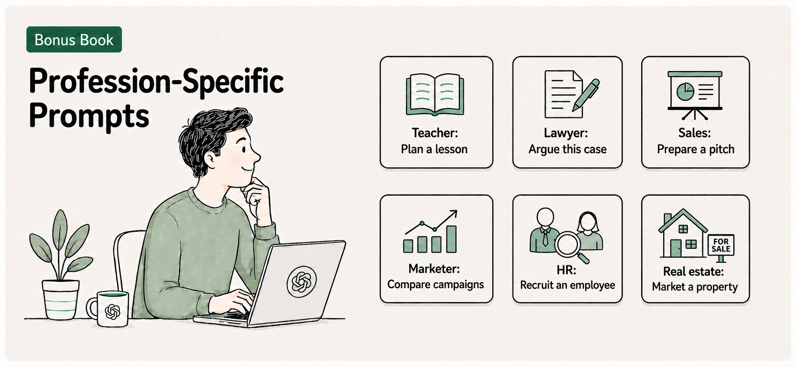

*Regulatory details in this guide were last verified against primary sources in August 2026. Rules, guidance, and links change quickly. Confirm current requirements before relying on any of them.*

- [Introduction](#introduction)
- [Education and teaching](#education-and-teaching)
- [Finance and accounting](#finance-and-accounting)
- [Freelancers](#freelancers)
- [Government and public sector](#government-and-public-sector)
- [Healthcare](#healthcare)
  - [Mental health and social work](#mental-health-and-social-work)
- [HR and recruiting](#hr-and-recruiting)
- [Independent contractors and tradesfolk](#independent-contractors-and-tradesfolk)
- [Insurance](#insurance)
- [Journalism and media](#journalism-and-media)
- [Legal](#legal)
- [Marketing](#marketing)
- [Publishing books](#publishing-books)
- [Nonprofit and fundraising](#nonprofit-and-fundraising)
- [Real estate](#real-estate)
- [Sales](#sales)
- [Scientists and engineers](#scientists-and-engineers)
- [Small business owner: retail, cafe, restaurant](#small-business-owner-retail-cafe-restaurant)
- [Software, IT, and cybersecurity](#software-it-and-cybersecurity)
- [Visual creatives](#visual-creatives)
- [If your profession isn't listed here](#if-your-profession-isnt-listed-here)
  - [Try it now](#try-it-now)
    - [Check the result](#check-the-result)

# Introduction

In *ChatGPT Visual Bible*, *Book 1* to *Book 4* taught you how to write a good prompt for almost any task. This guide adds a layer that general prompting skill does not cover: the specific duties, risks, and rules that come with your profession.

A lawyer, a nurse, a teacher, and a real estate agent can all ask ChatGPT to draft a letter. Only one of them needs to worry about attorney-client privilege before doing it. This guide walks through fourteen professions where using AI carries a duty or risk beyond the general advice throughout *ChatGPT Visual Bible*, along with adaptable prompts for each.

Each profession includes a United States paragraph and a United Kingdom paragraph, because those are the two regulatory systems this guide can cover in depth. If you work in a different country, or your role sits under a devolved UK regulator (Scotland and Northern Ireland often run separate legal, education, and professional-conduct systems from England and Wales), use the prompt at the end of each section to research your own local rules. Treat the US and UK paragraphs as worked examples of the kind of duty to look for, not as the only two that matter.

Not every reader has a compliance team, a firm, or a board behind them. If you are a sole practitioner, a freelancer, or a one-person operation, the same habits still apply; you are the one deciding your own policy rather than following someone else's. And not every reader is choosing AI use freely: if your employer, school, or agency already requires a specific approved AI tool, the risk shifts from "should I use AI" to "am I using the approved tool correctly," which the Watch out and Good practice boxes below still apply to.

If your work depends on keeping data inside a particular country or region, the companion bonus book *Beyond Your First AI* covers when Mistral Vibe's EU data residency, or a paid enterprise plan from a major provider, might suit you better than a free consumer account.

Treat every prompt here as a starting point, not a finished product. Nothing in this guide replaces the judgment of your compliance team, your legal counsel, or your professional licensing body. Rules change by state, country, and employer, so confirm current requirements before you rely on any of them.

> **Special considerations for regulated and client-facing professions**: Some professions carry a duty that changes how you should use an AI assistant: a duty of confidentiality, a duty to avoid discrimination, a duty to disclose, or a duty to verify before anything reaches a client or the public. This chapter covers fourteen such professions. Each section names the specific risk, gives one habit that reduces it, one mistake to avoid, and several prompts you can adapt to your own work.

# Education and teaching

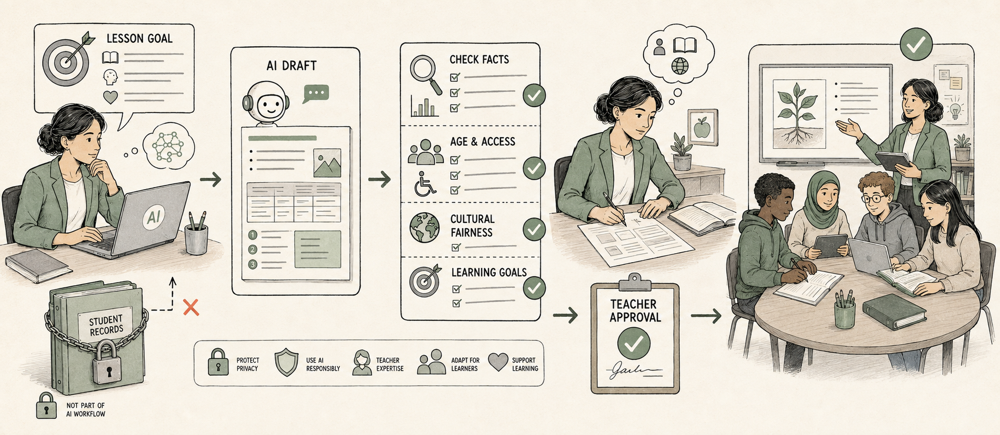

Teachers carry a duty to protect student privacy under the Family Educational Rights and Privacy Act (FERPA), and a separate duty to model honest, disclosed use of AI for the students they teach. Both duties apply whether the AI use is for lesson planning or for grading student work.

In the United Kingdom, the Department for Education, which covers England only (Scotland, Wales, and Northern Ireland each run their own education systems and guidance), expects schools to complete a Data Protection Impact Assessment under the UK GDPR before adopting any AI tool, and its guidance is explicit that student data should never go into an open, public AI platform. Schools are expected to adopt a written AI use policy and to be transparent with parents and students about how and where AI is used with their data.

If you are outside the US and UK, ask:
```
What student data protection rules apply to teachers using AI tools with school data in [your country]?
```

> **Watch out:** Free consumer AI accounts are generally not appropriate for uploading identifiable student work, grades, or behavior notes. Check whether your school or district has an approved, FERPA-compliant AI tool before using student data with any assistant.

> **Good practice:** Use AI freely for your own planning work (lesson ideas, rubrics, practice questions) where no student data is involved, and be explicit with students about when and how you used AI in materials you give them.

> **Learn more online:** The UK government's guidance on generative AI in education is published at [gov.uk](https://www.gov.uk/government/publications/generative-artificial-intelligence-in-education/generative-artificial-intelligence-ai-in-education).

**Prompts to adapt:**
- `Plan a 45-minute lesson on [topic] for [grade level], including one hands-on activity and two check-for-understanding questions.`
- `Write five practice questions on [topic] at three difficulty levels, with an answer key.`
- `Draft a rubric for a [type of assignment] that scores [specific skills], with three performance levels for each.`
- `Suggest three ways to explain [a difficult concept] to students who struggled with the first explanation.`

# Finance and accounting

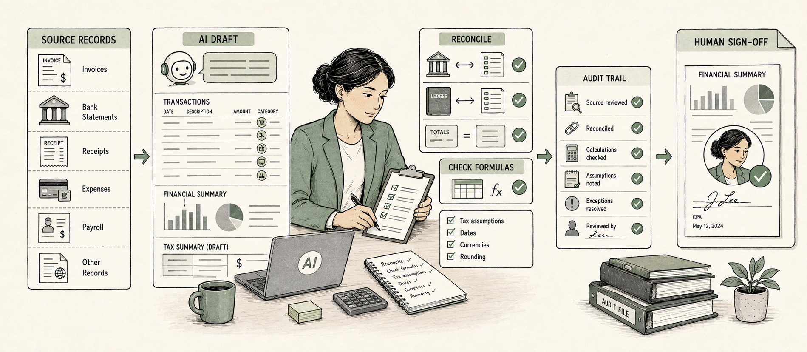

Financial professionals often hold a fiduciary duty, a legal obligation to act in a client's best interest rather than their own. The Securities and Exchange Commission and FINRA have both made clear that using AI to draft communications or analysis does not reduce a firm's existing supervisory, recordkeeping, and fair-dealing obligations. Client financial data also carries its own confidentiality expectations, separate from the advice itself.

In the United Kingdom, the Financial Conduct Authority (FCA) regulates AI use through its existing, technology-neutral rules rather than AI-specific ones, chiefly the Consumer Duty and the Senior Managers and Certification Regime. A firm must be able to show that any AI-assisted customer interaction, from a chatbot answering a pension question to an AI-drafted suitability letter, still delivers the good outcomes Consumer Duty requires, and a named senior manager remains accountable for harm the AI causes.

If you are outside the US and UK, ask:
```
What financial regulator rules apply to using AI in client-facing financial advice in [your country]?
```

> **Watch out:** Do not paste a real client's account numbers, balances, or portfolio details into a consumer AI account. Firms remain responsible for supervising and retaining anything AI helps produce, so check your firm's policy before using AI for client-facing work.

> **Good practice:** Use rounded, hypothetical figures when drafting explanations or templates, and only substitute real client numbers inside your firm's approved, supervised systems.

> **Learn more online:** The FCA publishes updates on AI and financial services at [fca.org.uk](https://www.fca.org.uk).

**Prompts to adapt:**
- `Explain [a financial concept, such as a Roth conversion] in plain language for a client with no finance background.`
- `Draft a template email summarizing quarterly performance for a hypothetical portfolio with a [percentage] return, with placeholders for real figures.`
- `List the standard disclosures typically required when discussing [a type of financial product], so I can confirm my draft is complete.`
- `Summarize this general market trend in two paragraphs suitable for a client newsletter: [paste public article or data].`

# Freelancers

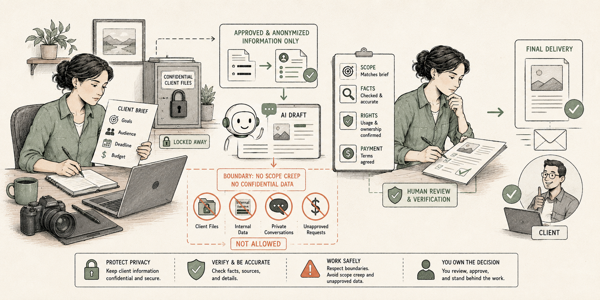

Freelancers answer to a contract and a platform more often than to a government regulator, and both now have real AI rules attached. Upwork's policy, updated January 2026, opts freelancer messages and work product into training Upwork's own AI models by default unless the freelancer changes their AI Preferences, and separately requires freelancers to get written client consent, disclose which AI tools and data are involved, and confirm the tool's own terms do not allow training on the client's data, before using AI on paid client work. Fiverr uses a lighter, conditional model: sellers do not have to disclose AI use in a gig description, only if a client asks directly or has made a "no AI" request before the order starts.

In the United Kingdom, there is no single freelancer-specific AI regulator, but two ordinary rules apply with full force to a one-person business. A freelancer who holds a client's name, contact details, or other personal data is a data controller under the UK GDPR in exactly the same way a large company is; there is no size exemption for being a sole trader. And because UK copyright law's treatment of AI-generated deliverables is currently under review (see Publishing books and Visual creatives), a freelancer's own contract, not a default legal rule, is the most reliable way to make ownership of AI-assisted work clear to a client.

If you are outside the US and UK, ask:
```
What contract, copyright, or data protection rules apply to freelancers using AI on client work in [your country]?
```

> **Watch out:** Read your freelance platform's actual AI terms before using an AI tool on client work. Upwork, for example, requires written client consent and specific tool disclosure, and default settings may opt your own messages and deliverables into training the platform's AI unless you check them.

> **Good practice:** Put your own AI-use terms in your contract or proposal template, stating plainly which parts of your process may involve AI, so clients know upfront rather than finding out later, and recheck your platform's default settings whenever they change.

> **Learn more online:** Fiverr's public guidance on using AI as a freelancer or client is at [help.fiverr.com](https://help.fiverr.com/hc/en-us/articles/37333301560593-Using-AI-on-Fiverr-Guidelines-for-freelancers-and-clients).

**Prompts to adapt:**
- `Draft a short AI-use clause for a freelance contract or proposal template, explaining which parts of my process may involve AI assistance.`
- `Summarize this client brief into a scope-of-work outline with deliverables and a rough timeline: [paste brief].`
- `Draft a polite message to a client checking whether they are comfortable with AI-assisted drafts before I start using them on this project.`
- `Rewrite this invoice reminder message to sound firm but friendly: [paste draft].`

# Government and public sector

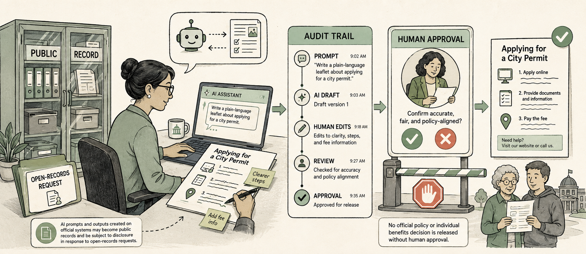

Public-sector employees produce records that are often subject to public disclosure laws, such as the Freedom of Information Act at the federal level or an equivalent state open-records law. Any AI-assisted draft, note, or analysis created as part of official business can become a public record, and government agencies are increasingly expected to keep AI use explainable and auditable rather than hidden inside an unreviewed tool.

In the United Kingdom, the Cabinet Office's Central Digital and Data Office publishes a Generative AI Framework setting out principles for safe use of AI across government and the wider public sector. Records of that AI use are not automatically private: a Freedom of Information Act 2000 request in 2025 successfully obtained records of a government minister's interactions with ChatGPT, establishing that AI prompts and outputs created in the course of official business can be disclosable public records, just as an email or a paper memo would be.

If you are outside the US and UK, ask:
```
What public records or freedom of information rules apply to government staff using AI tools in [your country]?
```

> **Watch out:** Do not use a consumer AI account for drafting anything that states or implies official agency policy, legal position, or a decision about a specific person's benefits or case, without review and approval through your normal process.

> **Good practice:** Keep a record of when and how you used AI to help draft public-facing material, the same way you would document any other drafting tool, in case the record is requested later.

> **Learn more online:** The UK government publishes its Generative AI Framework for the public sector at [gov.uk](https://www.gov.uk).

**Prompts to adapt:**
- `Draft a plain-language summary of [a public policy or program] for a general audience, based only on this official source text: [paste text].`
- `Suggest a structure for a public meeting agenda covering these topics: [list topics].`
- `Rewrite this internal memo into a public-facing FAQ, keeping every fact unchanged: [paste memo].`
- `List the standard sections typically included in a [type of public report], so I can check my draft is complete.`

# Healthcare

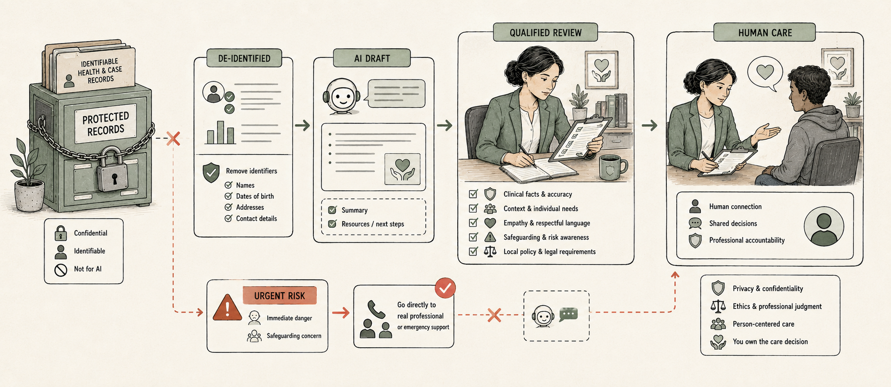

Healthcare professionals work under the Health Insurance Portability and Accountability Act (HIPAA), which protects patient health information from being shared with anyone or anything that has not agreed to protect it the same way, typically through a business associate agreement, a contract that legally binds a vendor to HIPAA's privacy and security rules. The US Department of Health and Human Services' Office for Civil Rights has made clear that HIPAA's technical safeguards apply to any AI system that touches protected health information, and that a vendor's own security claims do not remove your organization's responsibility to verify them.

In the United Kingdom, NHS England's own guidance tells staff not to enter personal, confidential, or business-sensitive data into public generative AI tools such as ChatGPT, under the UK General Data Protection Regulation (UK GDPR) and the wider duty of patient confidentiality. Reusing patient data for training or research purposes generally requires either removing identifying details or, where that is not possible, a formal application to the Health Research Authority's Confidentiality Advisory Group.

Mental health and substance-use records carry even stricter protection than general medical records; the next section covers that separately.

If you are outside the US and UK, ask:
```
What patient data protection and confidentiality rules apply to healthcare staff using AI tools in [your country]?
```

> **Watch out:** A consumer AI account is not a HIPAA-covered tool unless your organization has a signed business associate agreement with the provider. Typing a real patient's name, diagnosis, or chart notes into a general AI chat is a data breach, not a shortcut.

> **Good practice:** Draft with placeholders (a fictional patient, a general condition, a rounded age) and only add real identifying details afterward, inside your organization's approved systems.

> **Learn more online:** NHS England Digital publishes AI guidance for patients and service users at [digital.nhs.uk](https://digital.nhs.uk/data-and-information/information-governance/guidance/artificial-intelligence/guidance-for-patients-and-service-users).

**Prompts to adapt:**
- `Draft a plain-language explanation of [a diagnosis or condition] that a patient with no medical background could understand.`
- `Write a template for a discharge instruction sheet for [a condition or procedure], with placeholders for medication names and follow-up dates.`
- `Summarize the general symptoms and standard treatment options for [a condition], citing that this is general information and not a diagnosis.`
- `Suggest three ways to phrase a difficult conversation about [a general topic, such as a treatment delay], without referencing a specific patient.`

## Mental health and social work

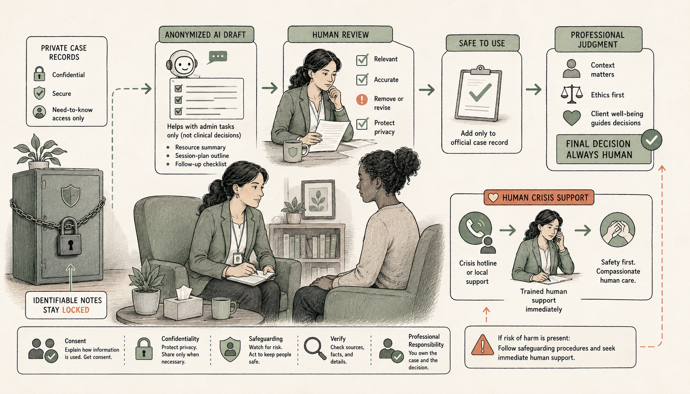

Therapists, counselors, and social workers carry the same HIPAA duties as other healthcare professionals, plus two extra layers. HIPAA gives special, stricter protection to "psychotherapy notes," the personal notes a therapist keeps about a counseling session, separate from the rest of the medical record. A separate federal law, 42 CFR Part 2, gives substance use disorder treatment records even stricter confidentiality; a 2024 update aligning that law more closely with HIPAA took full effect in February 2026, but its stricter consent requirements remain. Social workers and counselors also carry mandatory reporting duties in many states, a legal responsibility that is yours alone to carry out and that no AI assistant can fulfil for you.

In the United Kingdom, the British Association for Counselling and Psychotherapy's new Ethical Framework for the Counselling Professions, mandatory from November 2026, includes guidance on AI and digital technology for the first time. The Health and Care Professions Council separately regulates practitioners across the wider talking therapies, including registered social workers.

If you are outside the US and UK, ask:
```
What extra confidentiality rules apply to therapy, counseling, or social work records when using AI tools in [your country]?
```

> **Watch out:** Never paste psychotherapy notes, substance-use treatment details, or anything that could identify a client into a general AI account. These records carry stricter protection than ordinary medical notes, and a mandatory reporting duty is yours to carry out, not an AI's.

> **Good practice:** Use AI for general resource drafting, such as a coping-strategies handout or a plain-language explanation of a therapeutic approach, built from hypothetical situations. Keep session notes and identifying details entirely out of consumer AI tools.

> **Learn more online:** The British Association for Counselling and Psychotherapy publishes AI guidelines for practitioners at [bacp.co.uk](https://www.bacp.co.uk/media/23675/bacp-ai-guidelines.pdf).

**Prompts to adapt:**
- `Draft a plain-language handout on [a coping strategy or therapeutic technique] that a client could take home.`
- `Explain [a therapeutic approach, such as cognitive behavioral therapy] in accessible language for someone new to therapy.`
- `Suggest three open-ended questions a counselor could ask to explore [a general topic, such as workplace stress], without referencing a specific client.`
- `Summarize the general signs and standard support options for [a general condition], noting this is general information and not a diagnosis.`

# HR and recruiting

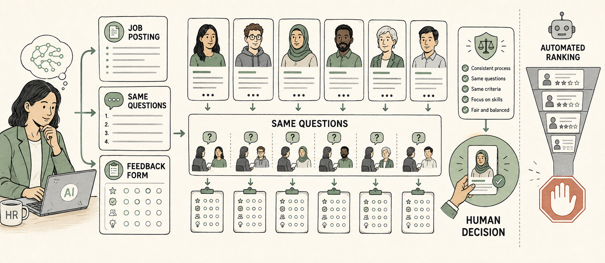

Recruiters and HR professionals sit close to employment discrimination law, including Title VII, the Americans with Disabilities Act, and the Age Discrimination in Employment Act. The Equal Employment Opportunity Commission has made clear that using an AI tool in hiring does not shift responsibility for a discriminatory outcome away from the employer, even when a vendor built the tool. Part of that responsibility is testing for adverse impact: a statistical pattern showing that a process disqualifies people in a protected group at a meaningfully higher rate than others, even without anyone intending it. Some states and cities, including New York City's Local Law 144, add their own audit and disclosure requirements for automated hiring tools.

In the United Kingdom, the Equality Act 2010 prohibits both direct and indirect discrimination in recruitment across nine protected characteristics, and it applies to a decision made or supported by AI just as it applies to a human interviewer. In March 2026, the Information Commissioner's Office (ICO) published a report and draft guidance on automated decision-making in recruitment, finding that many employers who believed their AI tool was only supporting a human decision were, in practice, letting it make the decision outright.

If you are outside the US and UK, ask:
```
What employment discrimination rules apply to using AI in hiring decisions in [your country]?
```

> **Watch out:** Do not use AI to screen, score, or rank real candidates without confirming your organization has tested the process for adverse impact across protected groups. "The AI did it" is not a defense.

> **Good practice:** Use AI to draft job postings, interview questions, and structured feedback templates, which keep a human making every decision about an individual candidate.

> **Real-world example:** The ICO's March 2026 review of UK recruitment tools found that most employers using AI to screen candidates believed the tool was merely supporting a human decision, when in practice the tool was making the decision outright, a compliance gap the regulator described as widespread rather than exceptional.

> **Learn more online:** The UK government's guide to responsible AI in recruitment is published at [gov.uk](https://www.gov.uk/government/publications/responsible-ai-in-recruitment-guide/responsible-ai-in-recruitment).

**Prompts to adapt:**
- `Write a job posting for [role] that focuses on required skills and avoids language that could discourage any protected group from applying.`
- `Draft five structured interview questions for [role] that ask every candidate the same thing.`
- `Create a feedback template for interviewers to fill in after speaking with a candidate for [role], focused on job-related criteria.`
- `Summarize this policy document into a plain-language FAQ for new employees: [paste policy].`

# Independent contractors and tradesfolk

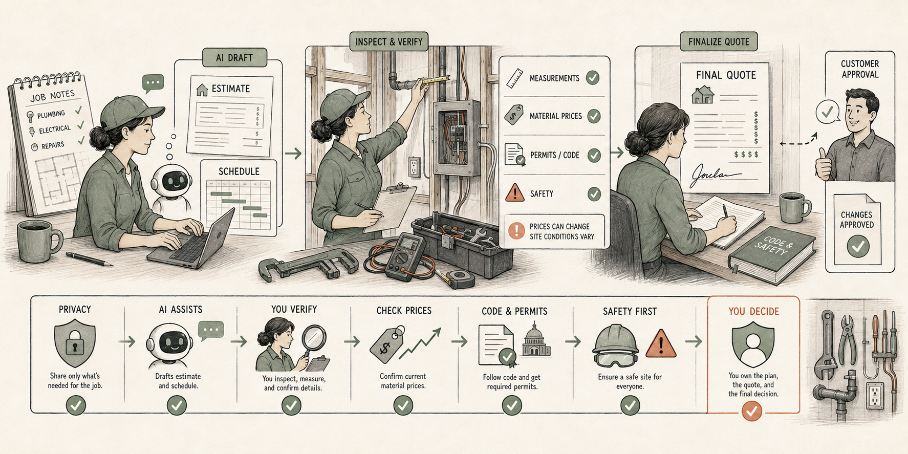

Plumbers, electricians, and handypeople work under codes and licenses set locally, not nationally, which makes an AI assistant's confident-sounding answer about "the code" a real risk. In the US, electricians and plumbers are typically licensed at the state or local level, and code compliance is the license holder's personal responsibility regardless of what a chatbot suggested. The National Electrical Code (NEC) itself updates on its own three-year cycle (the 2026 edition was issued in September 2025), and it is commonly adopted by state or local governments rather than being federal law itself, so the version in force depends on where you work. Unlicensed or non-compliant work is rarely covered by insurance, which turns a wrong AI-sourced code detail into a bill you pay yourself.

In the United Kingdom, some trades carry a legal registration requirement, not just a licensing recommendation. By law, anyone who works on gas appliances must be on the Gas Safe Register; there is no legal way around it. Most notifiable domestic electrical work in England and Wales must be carried out by an electrician registered with a government-approved competent-person scheme, or reported to building control, under Part P of the Building Regulations, and a homeowner or landlord who cannot prove that compliance is committing a criminal offence.

If you are outside the US and UK, ask:
```
What licensing or safety-code rules apply to tradespeople using AI for job estimates or guidance in [your country]?
```

> **Watch out:** Never treat an AI assistant's description of "the electrical code" or "the plumbing code" as current or complete for your exact jurisdiction. Codes are set locally or by state, updated on their own schedule, and AI training data can lag behind the current edition. AI output is never a substitute for your license, your Gas Safe registration, or a Part P sign-off.

> **Good practice:** Use AI to draft customer-facing estimates, explain a job in plain language, or organize a punch list, then verify any code-specific detail against your current local code book or licensing board before you rely on it.

> **Learn more online:** The Gas Safe Register, the UK's legally required register for anyone working on gas appliances, is at [gassaferegister.co.uk](https://www.gassaferegister.co.uk).

**Prompts to adapt:**
- `Draft a plain-language estimate explaining the scope of work for [job description], based on these actual costs and materials: [list costs and materials].`
- `Write a follow-up text to a customer confirming the appointment time and what to expect during [type of job].`
- `Summarize this inspection report into a checklist a homeowner could understand: [paste report].`
- `Draft a simple maintenance reminder message for customers due for [type of service] every [interval].`

# Insurance

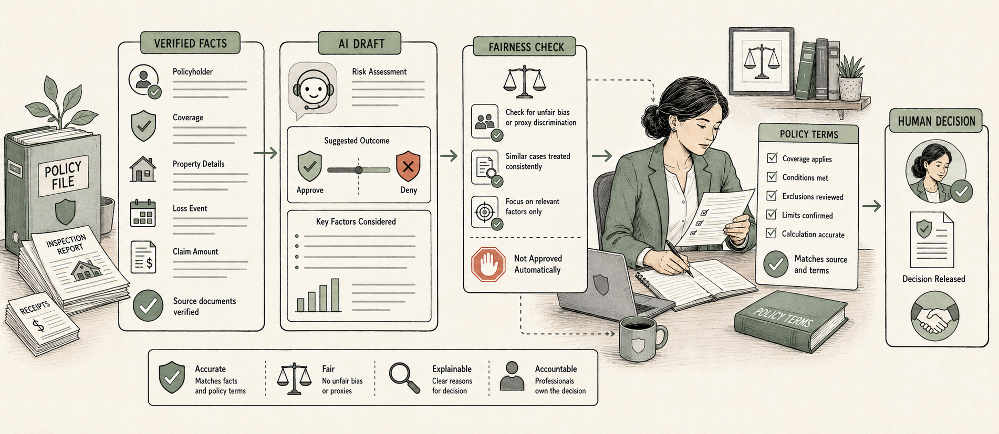

Underwriters, claims adjusters, and insurance agents work under rules coordinated by the National Association of Insurance Commissioners (NAIC), a body that develops model regulation for individual state insurance departments to adopt. Its Model Bulletin on the Use of AI Systems by Insurers, first published in 2023, requires insurers to maintain a written AI governance program covering underwriting, rating, claims, fraud detection, and marketing, with documentation detailed enough for a regulator to reconstruct any specific consumer-facing decision. More than half of US states had adopted the bulletin or substantially similar rules by early 2026.

In the United Kingdom, the Financial Conduct Authority is assessing how insurers use AI in underwriting, claims, and customer service as part of its 2026 supervisory priorities, expecting firms to monitor consumer outcomes under Consumer Duty. The Prudential Regulation Authority has no AI-specific rules yet but monitors AI use as part of its ordinary safety and soundness supervision.

If you are outside the US and UK, ask:
```
What insurance regulator rules apply to using AI in underwriting or claims decisions in [your country]?
```

> **Watch out:** Do not let an AI-assisted underwriting or claims decision go out without being able to explain the specific factors behind it. Regulators expect a documented, reviewable decision trail, not just a score from a tool no one in your organization can explain.

> **Good practice:** Keep a plain-language record of the specific factors an AI tool used for any adverse underwriting or claims decision, so you can explain it to a regulator or a policyholder who asks.

> **Real-world example:** Twelve US states are jointly piloting a standardized AI-review tool for insurance examiners in 2026, reflecting how seriously regulators now take an insurer's ability to explain an AI-assisted decision during an audit.

> **Learn more online:** The NAIC's artificial intelligence resources for insurers are published at [content.naic.org](https://content.naic.org/insurance-topics/artificial-intelligence).

**Prompts to adapt:**
- `Draft a plain-language explanation of why a claim for [type of claim] was approved, denied, or adjusted, based only on these specific factors: [list factors].`
- `Summarize this policy document into an FAQ answering common questions about [type of coverage].`
- `List the standard factors typically considered when underwriting a [type of policy], so I can confirm our documented criteria matches this.`
- `Draft a customer-facing letter explaining a premium change for [type of policy], using only these actual factors: [list factors].`

# Journalism and media

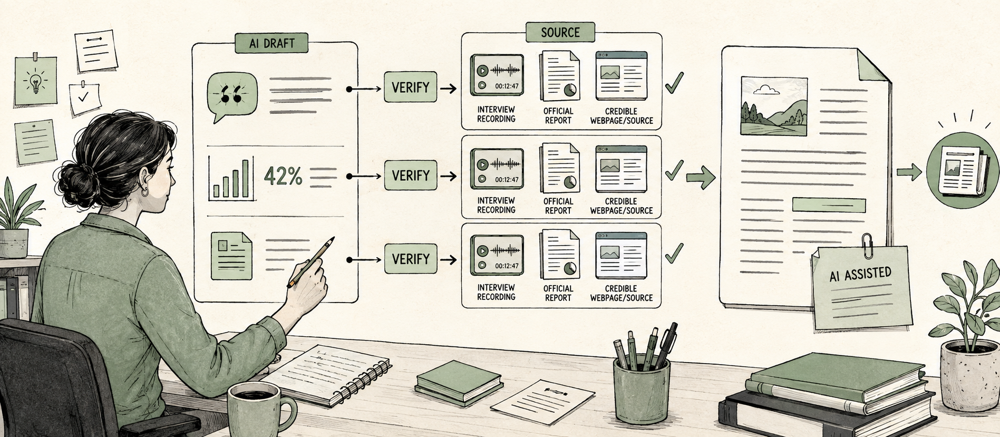

Journalists carry a duty to verify facts and disclose their methods, both of which are directly challenged by generative AI. A fabricated quote, an invented statistic, or an unverified claim from an AI assistant becomes a much bigger problem once it appears under a byline. Newsrooms are still building formal AI policies industry-wide, but the underlying duties of sourcing, accuracy, and disclosure have not changed.

In the United Kingdom, the Independent Press Standards Organisation (IPSO) holds publishers to the Editors' Code of Practice regardless of how a story was produced. Clause 1 of the Code requires care not to publish inaccurate, misleading, or distorted material, and responsibility for anything an AI tool gets wrong still rests with the publisher, not the tool. Ofcom has separately been examining AI content labeling for broadcast material, though the UK does not yet impose a statutory AI-labeling requirement.

If you are outside the US and UK, ask:
```
What accuracy and disclosure standards apply to journalists using AI tools in [your country]?
```

> **Watch out:** Never publish a quote, statistic, or citation produced by AI without verifying it against a real, checkable source. AI assistants can produce confident, detailed, and entirely invented details.

> **Good practice:** Use AI for structure, summarization, and first-draft organization, and disclose to your editor and, where your outlet requires it, to readers, which parts of a piece involved AI assistance.

> **Learn more online:** IPSO discusses AI-generated content and editorial standards at [ipso.co.uk](https://www.ipso.co.uk/news-analysis/does-ai-generated-content-change-editorial-standards/).

**Prompts to adapt:**
- `Summarize this transcript into a list of the five most newsworthy quotes, with timestamps: [paste transcript].`
- `Suggest three possible headlines for this draft that accurately reflect its content, without exaggerating the claim: [paste draft].`
- `Draft an outline for a story on [topic], listing the sources I still need to verify each claim.`
- `Rewrite this paragraph for a general audience, keeping every fact and figure exactly as stated: [paste paragraph].`

# Legal

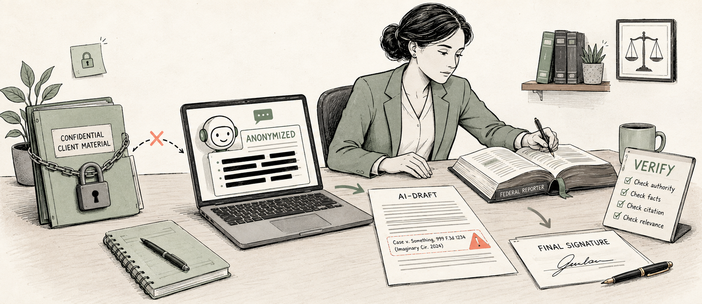

Attorneys hold a duty of confidentiality that covers almost everything a client tells them, including communications protected by attorney-client privilege, a legal protection that can be permanently lost once shared with an outside tool. Attorneys also hold a duty of competence that now extends to understanding the tools they use. The American Bar Association's Formal Opinion 512, issued in July 2024, states that lawyers using generative AI must understand its capabilities and limitations under Model Rule 1.1 and must protect client information under Model Rule 1.6, regardless of which AI tool touches that information. More than a dozen state bars have since issued their own opinions on the same questions.

In the United Kingdom, the Solicitors Regulation Authority (SRA) has not written AI-specific rules, because it considers the existing SRA Standards and Regulations sufficient: the duty of confidentiality and the duty of competence already cover how a solicitor uses any tool, including AI. Sending client information to a general AI tool without checking its terms can itself breach confidentiality, and using an open, public AI tool for legal research can waive legal professional privilege. In June 2025, the Divisional Court warned that AI tools are not reliable for legal research on their own and that a solicitor who files unverified, AI-generated case citations risks contempt of court. Scotland runs a separate legal system regulated by the Law Society of Scotland, which published its own Guide to Generative AI rather than relying on SRA guidance; if you practice in Scotland, follow that guide instead.

If you are outside the US and UK, ask:
```
What confidentiality and legal professional privilege rules apply to a lawyer using AI tools in [your country]?
```

> **Watch out:** Never paste client names, case facts, or privileged communications into a consumer AI account unless your firm has confirmed that the account meets its confidentiality and data-retention requirements. A general-purpose free account is rarely the right place for this.

> **Good practice:** Use AI to draft, summarize, and organize using anonymized or hypothetical facts, then add real client details yourself once the draft is ready for your own systems.

> **Learn more online:** The SRA publishes compliance tips for solicitors using AI and other technology at [sra.org.uk](https://www.sra.org.uk/solicitors/resources/innovate/compliance-tips-for-solicitors/).

**Prompts to adapt:**
- `Summarize the key deadlines and obligations in [this contract, with names and figures replaced by placeholders], and flag anything unusual for a [type of agreement].`
- `Draft an outline for a client letter explaining [a legal concept] in plain language, without referencing any specific case facts.`
- `List the standard elements of a [type of motion or filing] in [jurisdiction], so I can confirm my draft includes everything required.`
- `Rewrite this paragraph from a contract to use clearer, plainer language, without changing its legal meaning.`

# Marketing

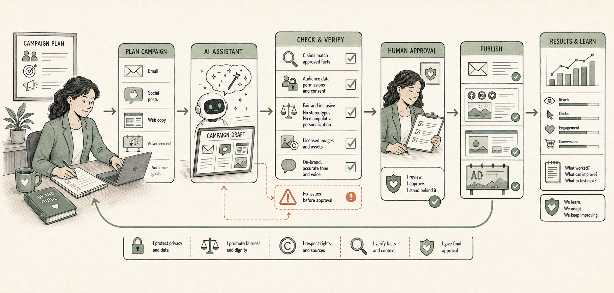

Marketers who use AI to help write or generate content face a two-part disclosure rule. As of 2026, the Federal Trade Commission generally expects separate disclosures for sponsorship and for AI involvement. A label that says a post is sponsored does not also cover AI involvement, and a label that says content is AI-generated does not also cover a paid relationship. Both statements must appear when both apply.

In the United Kingdom, there is no blanket legal requirement to label an ad as AI-generated. Instead, the Advertising Standards Authority and its Committee of Advertising Practice apply the existing CAP Code: the question is whether an audience would be misled by not knowing AI was involved, not whether AI was used at all. From June 2026, CAP guidance specifically addresses AI-generated deepfakes, synthetic endorsements, and misleading product depictions as breaches of existing rules, whether or not an advertiser separately discloses AI use.

If you are outside the US and UK, ask:
```
What advertising and AI-disclosure rules apply to marketers using AI-generated content in [your country]?
```

> **Watch out:** Do not treat a single disclosure, such as "#ad," as covering AI involvement too. If a post is both sponsored and AI-assisted, disclose both facts as separate, visible statements.

> **Good practice:** Keep a short internal note on which parts of a campaign used AI assistance (a draft, an image, a voiceover) so your disclosure is accurate rather than guessed at after the fact.

> **Real-world example:** In 2026, the UK's Information Commissioner's Office found that 93% of UK adults think AI-generated content should be labeled, well ahead of any legal requirement to do so. Some brands now disclose AI involvement voluntarily for exactly this reason, even where the CAP Code does not yet require it.

> **Learn more online:** The ASA and CAP explain their approach to AI disclosure in advertising at [asa.org.uk](https://www.asa.org.uk/news/disclosure-of-ai-in-advertising-striking-the-balance-between-creativity-and-responsibility.html).

**Prompts to adapt:**
- `Draft three subject-line options for an email campaign about [product or offer], each under 50 characters.`
- `Compare the tone and structure of these two ad drafts for [audience], and suggest which fits a [formal/casual] brand voice better.`
- `Suggest five angles for a social post about [topic], written for an audience that already knows the product.`
- `Rewrite this product description to lead with the customer benefit rather than the feature list: [paste description].`

# Publishing books

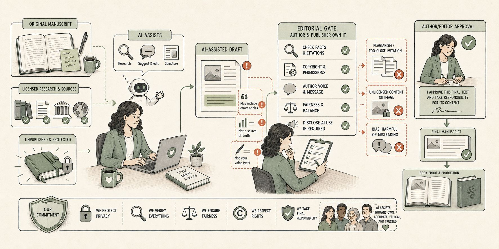

Authors face a copyright question that did not exist a decade ago. The US Copyright Office holds that human authorship is essential for copyright protection: a work that is entirely AI-generated cannot be copyrighted, while a work that combines human and AI-generated elements can be registered, but only the human-authored portions are protected. Applicants must disclose AI-generated material in a registration and briefly explain the human author's actual contribution; writing prompts alone, even detailed ones, does not count as authorship. Separately, Amazon's Kindle Direct Publishing (KDP) requires authors to disclose, to Amazon rather than to readers, whenever AI tools generated text, images, or translations in a book, though ordinary AI-assisted work such as brainstorming, grammar checking, or refining human-written text does not need disclosure. Undisclosed AI-generated content violates KDP's terms and can lead to a blocked book or a suspended account.

In the United Kingdom, the law currently works differently. Section 9(3) of the Copyright, Designs and Patents Act 1988 grants copyright to a "computer-generated work" even where no human author exists, crediting the person who made the arrangements for its creation, usually whoever wrote the prompt, as the legal author. However, a 2026 UK government review found this 35-year-old provision unclear given how generative AI actually works, and proposed removing it while keeping copyright protection for work created with genuine human-AI collaboration. Treat this as an area under active reform, not a settled rule.

If you are outside the US and UK, ask:
```
What copyright and disclosure rules apply to authors using AI when publishing a book in [your country]?
```

> **Watch out:** Do not assume you own full copyright in a purely AI-generated manuscript, cover, or illustration. In the US, that copyright may not exist for anyone to hold; in the UK, the rule granting it is under active review and could change.

> **Good practice:** Keep records of your own creative process (outlines, edited drafts, revision notes) that show your genuine human contribution, and disclose AI-generated content honestly wherever your publishing platform requires it.

> **Real-world example:** By April 2026, the US Copyright Office had already registered more than 6,000 works combining human and AI-generated material, showing that disclosed, human-led AI use is a normal and registerable part of publishing, not a disqualifying one.

> **Learn more online:** The US Copyright Office's dedicated AI resource page is at [copyright.gov/ai](https://www.copyright.gov/ai/).

**Prompts to adapt:**
- `Brainstorm five plot directions for [genre] involving [characters or situation], which I will develop and write myself.`
- `Suggest developmental edit notes for this chapter, pointing out pacing or consistency issues: [paste chapter].`
- `Draft three back-cover blurb options based on this synopsis I wrote: [paste synopsis].`
- `Check this manuscript excerpt for continuity errors against these character or setting notes: [paste notes].`

# Nonprofit and fundraising

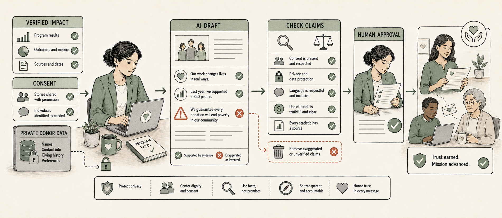

Nonprofit staff carry a duty to use donor data the way they said they would. The Federal Trade Commission's ban on unfair or deceptive practices applies to charities the same as any other organization, so a nonprofit's own privacy policy promises about donor data become enforceable once broken, including by an AI tool that uses donor data in a way the policy never disclosed. A 2026 sector survey found that 92% of nonprofits already use AI tools, but 76% have no AI governance policy covering how donor data is handled.

In the United Kingdom, the Fundraising Regulator published its first dedicated guidance on AI in fundraising in 2026, expecting charities to adopt a written AI policy before using AI tools, involve trustees in decisions about AI, and keep human oversight over the accuracy, fairness, and legality of anything AI drafts before it reaches a donor.

If you are outside the US and UK, ask:
```
What donor data protection or charity regulation rules apply to nonprofits using AI tools in [your country]?
```

> **Watch out:** Do not paste real donor names, giving histories, or contact details into a consumer AI account. Use anonymized or rounded, hypothetical figures instead, and check whether your organization's own privacy policy already promises donors you will not do this.

> **Good practice:** Put a simple, written AI policy in place, and have your board or a senior staff member sign off on it before your team uses AI in donor communications, matching what UK regulators already expect.

> **Learn more online:** The Fundraising Regulator's guidance on using AI in fundraising is published at [fundraisingregulator.org.uk](https://www.fundraisingregulator.org.uk/about-fundraising/resources/guidance-using-artificial-intelligence-fundraising).

**Prompts to adapt:**
- `Draft a thank-you letter for a donor who gave [amount or type of gift] to support [program], based only on these facts: [list facts].`
- `Summarize this annual report into a two-paragraph impact update for a newsletter, using only the figures provided: [paste report].`
- `Suggest three subject lines for a fundraising email about [campaign or cause], based on the actual campaign goal and deadline.`
- `Draft a simple, one-page AI use policy for a small nonprofit, covering donor data and donor communications.`

# Real estate

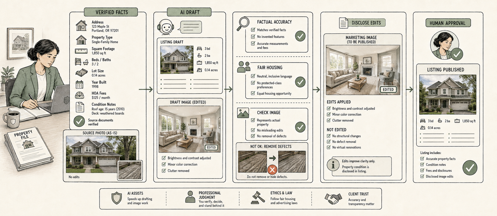

Real estate professionals work under the Fair Housing Act, which bans discrimination based on race, color, religion, sex, national origin, familial status, or disability in housing sales, rentals, and advertising. The US Department of Housing and Urban Development has issued guidance warning that AI-generated advertising and algorithmic tenant screening can violate the Fair Housing Act even without any intent to discriminate, through how an ad is worded or targeted alone. A handful of states now go further than this federal baseline: Colorado's AI Act, effective June 2026, treats AI used in tenant screening as high-risk and requires landlords themselves, not just their software vendors, to run impact assessments and give consumers notice, and Illinois and New York have advanced similar AI-specific housing protections.

In the United Kingdom, there is no direct equivalent to the Fair Housing Act, but the Equality Act 2010 covers housing and property services under the same nine protected characteristics that apply to employment: age, disability, gender reassignment, marriage and civil partnership, pregnancy and maternity, race, religion or belief, sex, and sexual orientation. An AI-generated listing or ad that indirectly targets or excludes people with one of these characteristics can breach the Act even without any intention to discriminate.

If you are outside the US and UK, ask:
```
What housing or property discrimination rules apply to AI-generated advertising in [your country]?
```

> **Watch out:** Review every AI-generated property description or ad for language that could describe or target a type of buyer or tenant rather than the property itself, such as references to a neighborhood's demographics or a preferred type of family.

> **Good practice:** Ask AI to describe the property, not the ideal buyer, and review the output against your board's fair housing guidelines before publishing.

> **Real-world example:** Colorado became the first US state to pass a law specifically treating AI used in tenant screening as high-risk, requiring landlords, not just software vendors, to run impact assessments and give consumers notice, effective June 2026.

> **Learn more online:** HUD's Office of Fair Housing and Equal Opportunity is at [hud.gov](https://www.hud.gov/program_offices/fair_housing_equal_opp).

**Prompts to adapt:**
- `Write a property listing description for [property details: beds, baths, square footage, features] that focuses only on the property itself.`
- `Suggest three subject lines for a listing email about [property], based only on its features and price.`
- `Draft a neutral, factual response to a buyer's question about [a neighborhood amenity, such as schools or transit], without commenting on who lives there.`
- `Summarize these inspection notes into a plain-language list for a buyer: [paste notes].`

# Sales

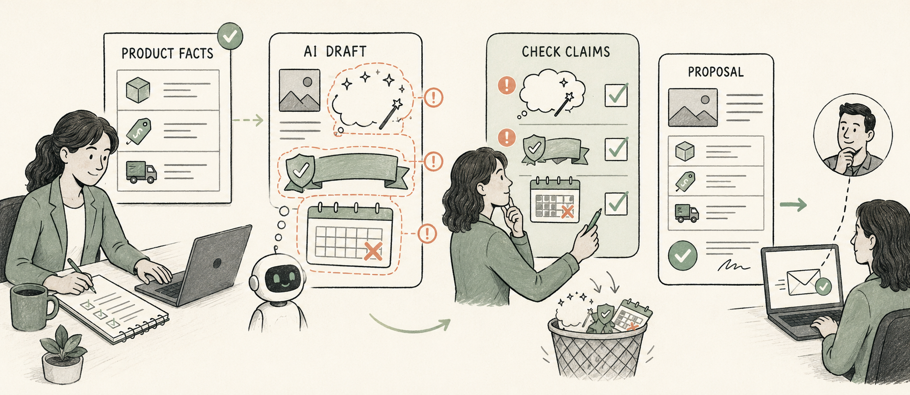

Sales professionals face a narrower but still real risk: overstating what a product or service can do. Claims made in a sales conversation, proposal, or follow-up email can create a binding representation, and general consumer-protection law treats a false or misleading claim about a product the same whether a human or an AI assistant wrote the words.

In the United Kingdom, the Consumer Protection from Unfair Trading Regulations 2008, carried forward under the Digital Markets, Competition and Consumers Act 2024, ban misleading actions and misleading omissions in any commercial practice, regardless of whether AI helped write the pitch. A buyer misled into a purchase can generally unwind the contract and claim a full refund within 90 days, so an AI-invented feature or guarantee is not a drafting slip your organization can shrug off.

If you are outside the US and UK, ask:
```
What consumer protection or misleading-advertising rules apply to sales claims made with AI help in [your country]?
```

> **Watch out:** Do not let AI invent a feature, guarantee, or delivery date your product does not actually have. Review every generated claim against your product's real specifications before it reaches a prospect.

> **Good practice:** Give the AI your actual product facts and pricing as part of the prompt, so it works from what is true rather than filling gaps with a plausible-sounding guess.

> **Learn more online:** The FTC publishes business guidance on advertising claims and AI at [ftc.gov/business-guidance](https://www.ftc.gov/business-guidance).

**Prompts to adapt:**
- `Using these facts about [the product: list specifications, pricing, and limits], draft a follow-up email after a sales call with [prospect's role or industry].`
- `Compare our offer against a competitor's based on these facts only: [list facts], and highlight where we are genuinely stronger.`
- `Draft three responses to the objection "[a common objection]," based only on our actual pricing and features.`
- `Summarize this call transcript into next steps and open questions: [paste transcript].`

# Scientists and engineers

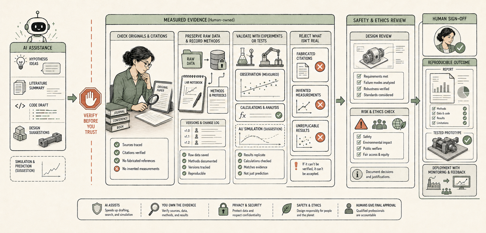

Researchers and engineers each carry a duty of personal accountability that AI cannot take on for them. Major academic publishers, including Elsevier, Springer Nature, Wiley, Taylor & Francis, and SAGE, along with the Committee on Publication Ethics (COPE), prohibit listing an AI tool as an author, because it cannot take responsibility for the accuracy or integrity of the work; they do generally permit disclosed AI assistance with drafting in specific, named sections. Separately, the National Society of Professional Engineers holds, in a position statement revised in February 2025, that a licensed engineer remains personally accountable for any AI-assisted design or calculation that affects public safety, the same as if they had done the work entirely by hand; a professional engineering stamp represents personal responsibility that AI use does not transfer away.

In the United Kingdom, the UK Research Integrity Office (UKRIO) published dedicated guidance, "Embracing AI with integrity," covering legal compliance, ethics, the integrity of the research record, publication practice, and the effect of AI on critical thinking, aimed at researchers at every career stage. UK Chartered Engineers remain personally accountable to their registering institution and the Engineering Council for AI-assisted work, on the same principle as the US position: the license holder, not the tool, is responsible.

If you are outside the US and UK, ask:
```
What research integrity or professional licensure rules apply to using AI in scientific or engineering work in [your country]?
```

> **Watch out:** Never list an AI tool as a co-author, or let AI-generated text, data, or images enter a manuscript or a stamped design without disclosure and your own independent verification. Major journals treat undisclosed AI use as a research-integrity issue, and a professional engineering stamp makes the human, not the tool, personally accountable for a safety-relevant error.

> **Good practice:** Use AI for literature summaries, drafting, or checking your own work for errors, disclose exactly where and how you used it according to your journal's or employer's policy, and independently verify any AI-generated citation, data point, or calculation before it goes into a publication or a stamped design.

> **Real-world example:** Despite roughly 70% of journals having adopted some form of AI policy, a review of about 75,000 papers published since 2023 found only around 76, roughly 0.1%, explicitly disclosed AI use, showing a wide gap between stated policy and actual disclosure that reviewers and editors are now watching for more closely.

> **Learn more online:** UKRIO's "Embracing AI with integrity" guidance is available at [ukrio.org](https://ukrio.org/ukrio-resources/embracing-ai-with-integrity/).

**Prompts to adapt:**
- `Summarize the methodology of this paper in plain language, so I can check I've represented it accurately in my literature review: [paste abstract or section].`
- `Suggest possible weaknesses or confounding variables in this experimental design: [describe design].`
- `Draft a plain-language summary of this paper's findings for a general audience, based only on this abstract: [paste abstract].`
- `Check this citation list for formatting consistency against [citation style], without changing any of the actual references.`

# Small business owner: retail, cafe, restaurant

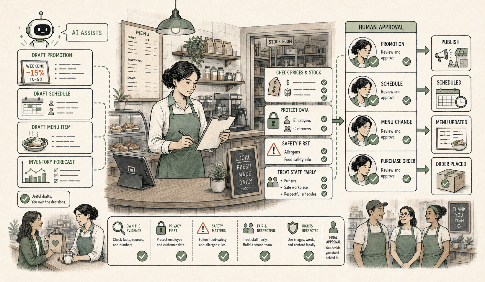

Owners of shops, cafes, and restaurants carry two duties that an AI-drafted menu or label can break without anyone noticing until it is too late: allergen accuracy and customer payment data security. In the US, the Food Allergen Labeling and Consumer Protection Act (FALCPA) requires the nine major allergens to appear on packaged food labels, and while there is currently no federal law requiring restaurants to disclose allergens on menus for food made and served onsite, that is changing state by state: California will require allergen disclosure on menus for chains with 20 or more locations starting July 2026, and New York will require written allergen labeling on prepackaged onsite food starting November 2026. Separately, the Payment Card Industry Data Security Standard (PCI DSS), an industry contractual standard rather than a government law, governs how a business handles customer card data; feeding real transaction or customer records into a consumer AI tool can breach that contractual obligation even without breaking any government law.

In the United Kingdom, Natasha's Law requires a full ingredient list with the 14 major allergens set apart from the rest of the list (typically in bold, italics, or a different color) on any food prepacked for direct sale, with no exemption for small businesses, sole traders, or market stalls. The law exists because of a fatal allergic reaction to an undeclared ingredient, and an AI-drafted label or menu that misses or miscategorizes an allergen carries the same liability as one written entirely by hand.

If you are outside the US and UK, ask:
```
What food safety, allergen labeling, or customer data rules apply to small businesses using AI in [your country]?
```

> **Watch out:** Never publish an AI-drafted menu, food label, or allergen list without a human checking every ingredient against what is actually in the dish. Allergen-labeling laws carry serious liability regardless of who or what drafted the wording.

> **Good practice:** Use AI for the non-safety-critical parts of your business, such as social captions, shift-change announcements, or review responses, and keep a human-verified master ingredient list that any AI-drafted menu text must be checked against before printing.

> **Learn more online:** The UK Food Standards Agency explains Natasha's Law and allergen labeling requirements at [food.gov.uk](https://www.food.gov.uk).

**Prompts to adapt:**
- `Draft three social media captions for [dish or promotion], based on this description: [description].`
- `Write a polite response template for a negative online review about [general issue], without admitting fault before we've reviewed the specific complaint.`
- `Draft a staff shift-change announcement about [policy change], in a friendly, clear tone.`
- `Summarize this month's sales categories into three observations I should look into further: [paste summary data].`

# Software, IT, and cybersecurity

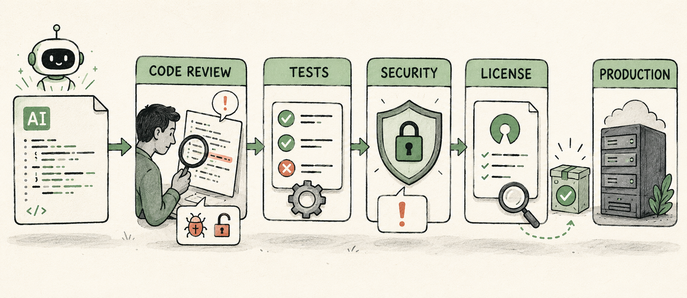

Developers and IT professionals face two risks that are easy to miss because they show up later, not immediately. A 2026 industry study testing over 500 AI-generated code samples across six major AI models found that roughly one in four contained a confirmed security vulnerability. Separately, the line between AI-generated code and open-source licensing remains legally unsettled: if AI-suggested code closely resembles a copyleft-licensed snippet and ends up in a proprietary product, the company can face license obligations it never knowingly accepted, and AI tool vendors generally disclaim liability for this, leaving the developer or company holding the risk.

In the United Kingdom, the National Cyber Security Centre (NCSC) warned in 2026 against "blindly trusting" AI-generated code, particularly in what it calls "vibe coding." Its guidance sets out a risk-based spectrum: acceptable for low-risk personal projects, but requiring full review, testing, and audit before use in anything approaching a critical system.

If you are outside the US and UK, ask:
```
What data protection or software liability rules apply to a business shipping AI-assisted code in [your country]?
```

> **Watch out:** Do not ship AI-generated code into a product without checking it for both license conflicts and known security issues. AI tool vendors generally disclaim liability for both, so the risk lands on you or your company, not the tool.

> **Good practice:** Treat AI-generated code like a contractor's first draft: review it, test it, and run it through your normal license and security scanning before it reaches production, scaling the depth of review to how critical the system is.

> **Real-world example:** The one-in-four vulnerability rate found in 2026 testing of AI-generated code is exactly why the NCSC now tells developers not to trust AI-written code without review, no matter how confident or complete it looks.

> **Learn more online:** The NCSC publishes guidance on AI and cybersecurity at [ncsc.gov.uk](https://www.ncsc.gov.uk).

**Prompts to adapt:**
- `Review this AI-generated function for [language] and list anything that looks like a security risk: [paste code].`
- `Explain what this code does in plain language, line by line: [paste code].`
- `Suggest test cases that would catch common mistakes in a function that [describe what the function should do].`
- `Summarize the open-source license terms of [library or package name] in plain language, including what it would require if I included its code in a commercial product.`

# Visual creatives

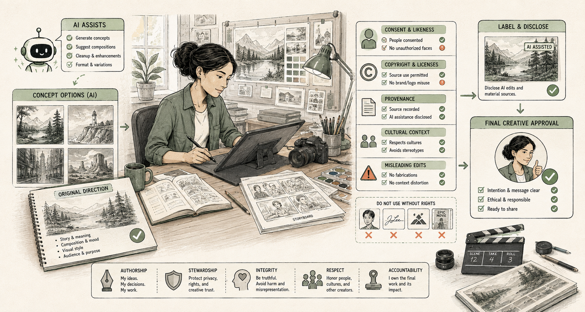

Graphic designers, illustrators, photographers, and video editors face the same copyright question as authors, with sharper stakes because clients often expect to buy exclusive rights. Under current US Copyright Office policy, a purely AI-generated image generally cannot be copyrighted at all, which means a designer who promises a client "full" or "exclusive" rights to a wholly AI-generated logo or illustration may be promising something that legally does not exist to hand over. Separately, several ongoing lawsuits by visual artists against AI image-generator companies over the use of their work as training data mean the provenance of an AI tool's training data is a live legal question, one that some clients now ask about directly.

In the United Kingdom, the starting position is different: Section 9(3) of the Copyright, Designs and Patents Act 1988 currently grants limited copyright, lasting up to 50 years, to a purely computer-generated image, crediting the person who arranged its creation as author. As with publishing, a 2026 government review has proposed removing this provision as unclear, while preserving copyright for genuinely human-AI collaborative work, so this is an active policy question rather than a fixed rule.

If you are outside the US and UK, ask:
```
What copyright rules apply to AI-assisted or AI-generated visual work in [your country]?
```

> **Watch out:** Do not promise a client full or exclusive copyright in a purely AI-generated image without checking your jurisdiction. In the US, that copyright often does not exist for the client to receive, and the UK's own rule on this is under review.

> **Good practice:** Document your own creative input (sketches, prompt refinement, manual edits, compositing) so you can show meaningful human authorship if a client, a court, or a registration examiner ever asks who created the work.

> **Real-world example:** Working visual artists have filed, and continue to pursue, lawsuits against AI image-generator companies over the use of their work as training data, which is why some clients now specifically ask which tool was used and what it was trained on before accepting AI-assisted artwork.

> **Learn more online:** The US Copyright Office's dedicated AI resource page is at [copyright.gov/ai](https://www.copyright.gov/ai/).

**Prompts to adapt:**
- `Suggest five visual concepts for [project type, such as a logo or poster] based on this brief, which I will develop into finished designs myself.`
- `Generate three color palette options that fit this brand description: [description].`
- `Write alt text describing this image for accessibility: [describe image].`
- `Draft a client-facing note explaining which parts of this project involved AI assistance and which were hand-created.`

# If your profession isn't listed here

These fourteen professions are not the only ones where AI carries a special duty or risk. They are the ones where client-facing work most often collides with a legal or ethical rule that a general AI prompting skill does not cover on its own. If your profession is not here, start with the section above that is closest to your own work, and ask AI directly:
```
What professional duties, confidentiality rules, or regulations should I be aware of when using AI at work as a [your profession] in [your country]?
```

## Try it now

Pick the profession above closest to your own work, or the one you interact with most. Adapt one prompt to a real, non-confidential task you have this week, using placeholders for any real names or figures. Review the result the way you would review a colleague's first draft, not a finished document.

### Check the result
- [ ] Did you replace every placeholder with real information only after reviewing the draft?
- [ ] Did you avoid entering any confidential, client, patient, student, or personal data into a general AI account?
- [ ] Would this draft still need a compliance, legal, or editorial review before it reaches a client, patient, student, or the public?
